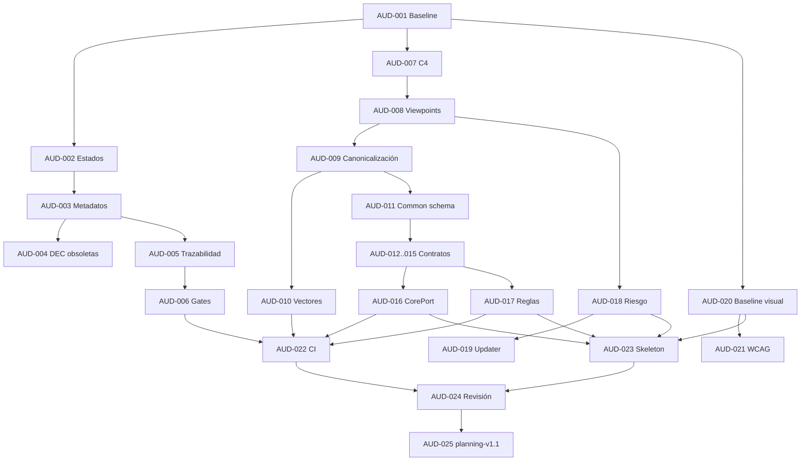

# Plan completo de remediación — ArchMaker planning-v1.1

## Objetivo

Convertir el baseline `planning-v1` en un baseline `planning-v1.1` internamente coherente, contractualmente ejecutable y suficientemente verificado para autorizar un walking skeleton Rust/Tauri/WASM. El plan no autoriza instalación real, runner privilegiado, acceso a discos, root ni shell arbitraria; esas capacidades permanecen fuera del MVP o condicionadas a gates posteriores.

La remediación sigue tres principios:

- Una sola autoridad para cada dato de gobierno.
- Evidencia ejecutable antes de marcar un gate como completo.
- Implementación incremental por vertical slices, no por capas horizontales completas.

## Resultado esperado

Al finalizar deben existir:

- Estados y gates inequívocos.
- Descripción arquitectónica con viewpoints y C4 corregido.
- Perfil normativo de canonicalización aceptado.
- Contratos MVP `v0` ejecutables.
- CorePort `v0` congelado.
- Corpus y vectores golden verificados en CI.
- Baseline visual y de accesibilidad.
- Riesgos residuales aprobados para el walking skeleton.
- Backlog con owners y dependencias.
- Dictamen Go limitado al walking skeleton.

## Gobierno del programa

### Roles

| Rol | Responsabilidad | Autoridad de aprobación |
|---|---|---|
| Product owner | Alcance, journeys y prioridad | Objetivos, requisitos y releases |
| Arquitectura | C4, viewpoints, ADR, módulos | Arquitectura y contratos transversales |
| Data/contracts owner | Schemas, migraciones, canonicalización | Contratos y compatibilidad |
| Security owner | Threat/hazard model, capabilities, updater | Riesgo residual y excepciones |
| UX/design owner | Design system, componentes, accesibilidad | Baseline visual y UX |
| Quality owner | Corpus, tests, CI y evidencia | Gates de verificación |
| Release owner | Packaging, firma, provenance y rollback | Release readiness |
| Revisor independiente | Revisión sin autoría directa | Conformidad y No-Go/Go recomendado |

NIST SSDF recomienda que el diseño sea revisado por personal cualificado no implicado en él o mediante procesos automatizados adecuados, y que los criterios de seguridad se rastreen durante el SDLC (refs. 1–2).

### Reglas de cambio

- Ningún documento aceptado se sobrescribe sin historial Git.
- Toda decisión estructural requiere ADR o referencia a una decisión existente.
- Los estados se leen de una fuente canónica y no se repiten narrativamente.
- Un gate solo cambia por evidencia, no por declaración manual.
- Todo P0 tiene owner, fecha objetivo y criterio de cierre.
- Toda excepción incluye riesgo residual y autoridad que la acepta.

## Workstreams

| Código | Workstream | Prioridad | Gate principal |
|---|---|---:|---|
| WS-01 | Gobierno y estados | P0 | G0–G2 |
| WS-02 | Trazabilidad y evidencia | P0 | G0–G10 |
| WS-03 | Arquitectura y C4 | P0 | G3 |
| WS-04 | Canonicalización y datos | P0 | G4 |
| WS-05 | Interfaces y CorePort | P0 | G5 |
| WS-06 | Validación y corpus | P0 | G7/G9 |
| WS-07 | Seguridad y updater | P0/P1 | G8/G9 |
| WS-08 | UX y design system | P1 | G6 |
| WS-09 | Calidad y CI | P0 | G9 |
| WS-10 | Delivery y walking skeleton | P0 | G10 |
| WS-11 | Runner v1 | Diferido | v1 |
| WS-12 | Enterprise | Diferido | Enterprise |

## Fase R0 — Congelación

**Objetivo:** preservar el estado auditado y evitar nuevas contradicciones durante la corrección.

### Acciones

1. Crear tag anotado `planning-v1-audit-baseline` sobre el commit auditado.
2. Crear rama `remediation/planning-v1.1`.
3. Congelar cambios funcionales mediante regla de rama.
4. Permitir únicamente documentación, contratos, fixtures, validadores y CI.
5. Crear milestone `planning-v1.1-remediation`.
6. Registrar todos los hallazgos `AUD-*` como issues.
7. Asignar owner y reviewer independiente a cada P0.

### Entregables

- `docs/00-governance/audit-baseline.md`
- Milestone y issues `AUD-*`.
- Branch protection documentada.
- Manifest de commit, fecha y toolchain.

### Criterio de salida

- Baseline recuperable.
- Ningún cambio funcional mezclado.
- Todos los P0 tienen owner.

## Fase R1 — Estados

**Objetivo:** eliminar la ambigüedad entre aprobación, implementación, verificación y release.

### Acciones

1. Crear `docs/00-governance/status-model.md`.
2. Definir máquinas de estado por entidad.
3. Añadir front matter YAML normalizado a documentos gobernados.
4. Migrar requisitos a estados multidimensionales.
5. Migrar ADR, decisiones, riesgos, gates y contratos.
6. Prohibir vocabularios no definidos.
7. Añadir JSON Schema para metadatos documentales.
8. Validar transiciones permitidas.

### Modelo mínimo

```yaml
id: FR-DRAFT-001
phase: MVP
priority: P0
documentStatus: accepted
approvalStatus: approved
implementationStatus: not-started
verificationStatus: not-verified
releaseStatus: ineligible
owners:
  - product
reviewers:
  - architecture
```

### Reglas

- `verificationStatus: passed` requiere evidencia.
- `releaseStatus: eligible` requiere implementación y verificación aprobadas.
- Un ADR `proposed` no puede satisfacer una dependencia que exige decisión aceptada.
- Un gate `complete` no puede depender de elementos incompletos.

### Criterio de salida

- Cero estados ambiguos.
- Validador de estados verde.
- `requirements.md`, `decision-register.md`, `gates.md` y `go-no-go.md` coherentes.

## Fase R2 — Decisiones

**Objetivo:** eliminar referencias obsoletas y normalizar la autoridad decisional.

### Acciones

1. Convertir `decision-register.md` en autoridad única.
2. Extraer decisiones a registros estructurados o front matter validable.
3. Eliminar texto “pendiente” duplicado en consumidores.
4. Enlazar cada decisión con requisitos, ADR, riesgos y gates afectados.
5. Registrar consecuencias aplicadas/no aplicadas.
6. Aclarar `DEC-005`: Apache-2.0 aceptada frente a alternativa dual.
7. Aclarar `DEC-006`: qué se firma, quién firma, claves y verificación offline.
8. Resolver `DEC-009` antes del runtime offline.
9. Resolver `DEC-010` antes de diseñar observabilidad externa.

### Validador requerido

```text
DEC reference exists
→ consumer does not restate status
→ accepted decision has date and authority
→ consequences have tracked issues
→ superseded decision points to successor
```

### Criterio de salida

- Cero referencias DEC obsoletas.
- Todas las consecuencias P0 tienen issue.
- No existe decisión aceptada con opción ambigua.

## Fase R3 — Gates

**Objetivo:** convertir los gates en evaluaciones reproducibles.

### Acciones

1. Crear `contracts/governance/gate.schema.json`.
2. Crear un manifiesto por gate con criterios y evidencia.
3. Separar `document-complete`, `design-ready`, `implementation-ready`, `verified` y `release-ready`.
4. Corregir G3: ADR-0007 no puede estar propuesto y satisfacer el gate.
5. Corregir G0–G2 para diferenciar documentación aprobada de métricas verificadas.
6. Generar la tabla Markdown desde manifiestos o validarla contra ellos.
7. Guardar evidence IDs: commit, run, artifact y reviewer.

### Ejemplo

```yaml
id: G4
status: blocked
criteria:
  - id: G4-C01
    requires: ADR-0007
    expectedState: accepted
  - id: G4-C02
    evidence: CI-CORPUS
    expectedResult: passed
```

### Criterio de salida

- La evaluación de gates es determinista.
- CI falla si la documentación contradice el manifiesto.
- `go-no-go.md` se deriva de los gates.

## Fase R4 — Arquitectura

**Objetivo:** producir una descripción arquitectónica coherente con ISO/IEC/IEEE 42010 y C4.

ISO/IEC/IEEE 42010 define viewpoints como convenciones para crear, interpretar y usar views que encuadran concerns de stakeholders (refs. 3–5).

### Acciones

1. Crear `docs/02-architecture/stakeholders-concerns.md`.
2. Crear `docs/02-architecture/viewpoints.md`.
3. Definir system-of-interest y boundaries.
4. Corregir System Context.
5. Corregir Container View.
6. Crear Component View Desktop.
7. Crear Component View Browser.
8. Crear Component View Rust Core.
9. Crear Component View Runner.
10. Crear Deployment View MVP Desktop.
11. Crear Deployment View MVP Web.
12. Crear Deployment View v1.
13. Crear Deployment View Enterprise.
14. Añadir runtime sequences para editar, resolver, exportar, actualizar y ejecutar plan.
15. Mapear concerns a views y ADR.

### Container View objetivo

- Desktop Application.
- Browser Application.
- Runner v1.
- Local Draft Store.
- Local Catalog Store.
- Enterprise Control Plane.
- Enterprise Store.

`Rust Core` deja de ser contenedor: pasa a componente interno enlazado mediante adaptadores Tauri/WASM. La vista actual contradice su propio deployment al representarlo como contenedor separado.

### Criterio de salida

- Ninguna librería figura como unidad desplegable.
- Todos los boundaries y protocolos están nombrados.
- Todos los concerns P0 tienen view.
- Revisión arquitectónica independiente aprobada.

## Fase R5 — Canonicalización

**Objetivo:** cerrar la semántica reproducible antes de depender de digests.

### Decisiones obligatorias

- Serialización normativa.
- UTF-8 y BOM.
- Normalización Unicode.
- Orden de propiedades.
- Arrays ordenados/no ordenados.
- Representación numérica.
- Tratamiento de unidades.
- Campos excluidos.
- Domain separation.
- SHA-256 y formato hexadecimal.
- Digest semántico frente a binario.
- Versionado del perfil.

### Acciones

1. Actualizar y aceptar `ADR-0007`.
2. Crear `docs/03-data/canonicalization-profile-v1.md`.
3. Crear `contracts/test-vectors/canonicalization/`.
4. Añadir vectores Unicode, números, mapas, arrays, timestamps y errores.
5. Implementar verificador independiente en CI sin convertirlo aún en código funcional de producto.
6. Exigir paridad Rust nativo/WASM cuando comience el skeleton.

### Criterio de salida

- ADR aceptado.
- Perfil inmutable `v1`.
- Golden vectors versionados.
- Dos implementaciones producen los mismos bytes y digest.

## Fase R6 — Contratos MVP

**Objetivo:** estabilizar los contratos mínimos del vertical slice.

El repositorio ya contiene Draft, Catalog, Diagnostic, Manifest y otros schemas reales. El Draft está cerrado y usa una unión discriminada, pero aún se declara draft y presenta ambigüedades de selección, revisión y tipos compartidos.

### Contratos P0

- `common.schema.json`.
- `draft.schema.json`.
- `catalog.schema.json`.
- `diagnostic.schema.json`.
- `manifest.schema.json`.
- `core-error.schema.json`.
- `changeset.schema.json`.

### Acciones Draft

1. Añadir `revision`.
2. Añadir `contentDigest` o ETag equivalente.
3. Definir `expectedRevision` en `saveDraft`.
4. Eliminar duplicidad `selection.optionId`/`single.optionId`.
5. Definir exclusividad con `oneOf`.
6. Cerrar números finitos y precisión.
7. Normalizar unidades mediante enum/versionado.
8. Tipar `secretRef` sin revelar secretos.
9. Versionar `$id` o documentar resolución estable.
10. Extraer `$defs` comunes.

### Acciones generales

- Límites de bytes, profundidad, arrays y strings.
- Compatibilidad backward/forward.
- Política de campos desconocidos.
- Corpus válido, inválido y adversarial.
- Fixtures de migración v5.1.
- Ejemplos no normativos separados.
- Change log por versión.

### Criterio de salida

- Schemas `v0` marcados `in-review` y después `accepted`.
- Meta-validación verde.
- Corpus verde.
- DTOs comprobados contra contratos.
- Ningún P0 semántico abierto.

## Fase R7 — CorePort

**Objetivo:** congelar una frontera implementable entre UI y dominio.

### Operaciones del skeleton

- `createDraft`.
- `loadCatalog`.
- `saveDraft`.
- `resolveDraft`.
- `validateDraft`.
- `buildManifest`.
- `exportArtifact`.

### Para cada operación

- Request y response versionados.
- Precondiciones y postcondiciones.
- Pureza/I/O.
- Idempotencia.
- Cancelación y timeout.
- Límites.
- Errores tipados.
- Eventos.
- Redacción.
- Test vectors.

### Reglas

- TypeScript no implementa reglas.
- Tauri/WASM son adaptadores.
- Errores públicos no son strings libres.
- `saveDraft` exige precondición de revisión.
- Operaciones puras no acceden a filesystem o red.

### Criterio de salida

- `CorePort v0` aceptado.
- DTO y error catalog aceptados.
- Contract tests definidos.
- Tauri y WASM pueden implementar la misma interfaz sin semántica divergente.

## Fase R8 — Validación

**Objetivo:** convertir reglas y diagnósticos en corpus ejecutable.

### Acciones

1. Normalizar operadores en `rule.schema.json`.
2. Reconciliar reglas heredadas con operadores permitidos.
3. Definir severidad y blocking de forma canónica.
4. Añadir localización estable de diagnósticos.
5. Definir orden estable.
6. Separar syntax, schema, reference, rule, resolution, target y provenance.
7. Crear corpus por operador.
8. Crear casos borde y adversariales.
9. Añadir property-based tests al comenzar código.
10. Mantener `target_is` fuera del MVP si sigue diferido.

### Criterio de salida

- Cada regla tiene fuente, inputs, condición, efecto, mensaje, remedio y pruebas.
- Ningún operador usado carece de definición.
- Diagnósticos reproducibles.
- CI valida corpus positivo y negativo.

## Fase R9 — Seguridad

**Objetivo:** convertir controles declarados en riesgos gobernables y pruebas verificables.

NIST SSDF exige criterios de seguridad rastreables, modelado de riesgos y revisión del diseño contra requisitos y riesgos (refs. 1–2).

### Acciones generales

1. Añadir scoring de riesgo inherente/residual.
2. Añadir owner y fecha de aceptación.
3. Vincular cada control con evidencia.
4. Cerrar RSK-003, RSK-004 y RSK-007 para el slice.
5. Definir política de secretos.
6. Definir supply-chain policy.
7. Definir vulnerability response.

### Tauri

Tauri bloquea por defecto comandos peligrosos; filesystem exige permission y scope, y el updater necesita capability explícita.

- Capability por ventana.
- Scope mínimo de filesystem.
- Sin plugin shell en MVP.
- CSP restrictiva.
- Sin contenido remoto en WebView.
- Updater aislado por capability.
- Tests negativos de paths y comandos.

### Updater

1. Threat model específico.
2. Canales stable/beta.
3. Firma y custody de claves.
4. Rotación y revocación.
5. Anti-rollback o política explícita.
6. Fail-open offline para uso de la app.
7. Rollback de actualización fallida.
8. Separar comprobación de descarga/instalación.

### Runner v1

- Hazard analysis.
- Autenticación de sesión.
- Nonce, expiración y replay protection.
- TOCTOU entre preflight y ejecución.
- Confirmación ligada a plan hash.
- Journal verificable.
- Recovery y cancelación.
- Allowlist tipada.

### Criterio de salida

- Riesgo residual P0 aceptado por autoridad.
- Pruebas negativas diseñadas.
- Updater no bloquea offline.
- Runner sigue bloqueado hasta gates v1.

## Fase R10 — UX

**Objetivo:** proteger el diseño heredado y hacer verificable la accesibilidad.

### Acciones

1. Capturar golden screenshots de referencia.
2. Inventariar tokens heredados.
3. Crear mapa `legacy value → semantic token`.
4. Definir tokens primitivos, semánticos, de componente y tema.
5. Formalizar `styles.css` por capas.
6. Documentar imports CSS por componente.
7. Crear contratos por componente.
8. Definir estados y keyboard maps.
9. Crear matriz WCAG 2.2 AA.
10. Definir combinaciones de navegador/lector de pantalla soportadas.
11. Añadir visual regression y a11y checks al skeleton.

### Evidencia mínima

- Baseline visual aprobado.
- Cero cambios visuales no justificados.
- Recorrido completo por teclado.
- Focus visible y estable.
- Errores/progreso anunciados.
- Reflow, zoom, contraste y reduced motion revisados.

### Criterio de salida

- Tokens preservados aprobados.
- Component contracts `v0`.
- Matriz de accesibilidad con evidencia automatizada y manual separada.

## Fase R11 — Calidad

**Objetivo:** demostrar reproducibilidad desde checkout limpio.

### Pipeline mínimo

1. Markdown lint.
2. Link check.
3. Mermaid parse/render.
4. Front matter schema.
5. IDs únicos.
6. Referencias resolubles.
7. Grafo de trazabilidad.
8. Estados válidos.
9. Gates coherentes.
10. JSON Schema meta-validation.
11. Corpus válido/inválido.
12. Checksums de `reference/`.
13. Secret scanning.
14. Dependency policy.
15. Licencias.

### Evidencia

```yaml
commit: <sha>
workflowRun: <url-or-id>
toolchain: ocked versions>
result: passed
reviewedBy: <owner>
reviewDate: <date>
```

### Criterio de salida

- Ejecución verde sobre commit protegido.
- Repetición local documentada.
- Versiones fijadas.
- Artefactos de evidencia conservados.

## Fase R12 — Walking skeleton

**Objetivo:** autorizar el primer código funcional sin abrir todo el MVP.

### Alcance incluido

- Rust workspace mínimo.
- Domain types mínimos.
- Catálogo embebido fixture.
- Draft en memoria y guardado local controlado.
- Una regla resoluble.
- Diagnostic tipado.
- Manifest canónico.
- Exportación JSON.
- Adaptador Tauri mínimo.
- Adaptador WASM/Web Worker mínimo.
- Golden parity.

### Alcance excluido

- Runner.
- Root y discos.
- Shell.
- Migración completa v5.1.
- Presets completos.
- Catálogos remotos.
- Enterprise.
- Campañas.
- Telemetría.
- Updater automático activado por defecto.

### Criterios de aceptación

- Mismo input produce mismo manifest y digest en nativo/WASM.
- Cero reglas duplicadas en TypeScript.
- Errores tipados.
- E2E offline.
- Test de escritura atómica y conflicto de revisión.
- Baseline visual sin regresiones no aprobadas.
- CI verde.

## Fase R13 — Revisión

**Objetivo:** emitir dictamen limitado y basado en evidencia.

### Acciones

1. Revisión independiente de arquitectura.
2. Revisión independiente de seguridad.
3. Revisión de accesibilidad del slice.
4. Auditoría de trazabilidad.
5. Recalcular G0–G10.
6. Emitir `planning-v1.1`.

### Resultados posibles

- `NO-GO`: persiste P0 o falta evidencia.
- `CONDITIONAL-GO`: solo para walking skeleton, con condiciones fechadas.
- `GO-MVP-0`: autorizado el slice definido, no el MVP completo.

## Backlog priorizado

| Issue | Prioridad | Dependencias | Entregable |
|---|---:|---|---|
| AUD-001 Freeze audit baseline | P0 | — | Tag, branch, milestone |
| AUD-002 Define status model | P0 | AUD-001 | `status-model.md` |
| AUD-003 Migrate governed metadata | P0 | AUD-002 | Front matter coherente |
| AUD-004 Remove stale DEC references | P0 | AUD-003 | Consumidores corregidos |
| AUD-005 Build traceability validator | P0 | AUD-003 | CI semántica |
| AUD-006 Materialize gate manifests | P0 | AUD-003,005 | Gates reproducibles |
| AUD-007 Correct C4 containers | P0 | AUD-001 | C4 corregido |
| AUD-008 Define viewpoints/concerns | P0 | AUD-007 | Matriz 42010 |
| AUD-009 Accept canonicalization ADR | P0 | AUD-008 | ADR-0007 aceptado |
| AUD-010 Add canonical vectors | P0 | AUD-009 | Golden corpus |
| AUD-011 Refactor common schema defs | P0 | AUD-009 | `common.schema.json` |
| AUD-012 Stabilize Draft v0 | P0 | AUD-011 | Schema + corpus |
| AUD-013 Stabilize Catalog v0 | P0 | AUD-011 | Schema + corpus |
| AUD-014 Stabilize Diagnostic v0 | P0 | AUD-011 | Schema + corpus |
| AUD-015 Stabilize Manifest v0 | P0 | AUD-010,011 | Schema + corpus |
| AUD-016 Freeze CorePort v0 | P0 | AUD-012..015 | API contractual |
| AUD-017 Normalize rule operators | P0 | AUD-013 | Corpus de reglas |
| AUD-018 Add residual risk model | P0 | AUD-008 | Riesgos gobernables |
| AUD-019 Threat-model updater | P0 | AUD-018 | Control DEC-007 |
| AUD-020 Freeze visual baseline | P1 | AUD-001 | Goldens/tokens |
| AUD-021 Create WCAG evidence matrix | P1 | AUD-020 | Plan accesibilidad |
| AUD-022 Prove clean CI | P0 | AUD-005,006,010..017 | Run verde |
| AUD-023 Define walking skeleton | P0 | AUD-016,017,018,020 | Slice aprobado |
| AUD-024 Independent review | P0 | AUD-022,023 | Dictamen externo |
| AUD-025 Publish planning-v1.1 | P0 | AUD-024 | Baseline nuevo |

## Dependencias críticas



## Matriz de gates

| Gate | Remediación | Evidencia de cierre |
|---|---|---|
| G0 | R0, R3 | Baseline + manifest de fuentes |
| G1 | R1, R3 | Estados coherentes + métricas con estado explícito |
| G2 | R1, R2 | Requisitos aprobados sin DEC obsoletas |
| G3 | R4, R5 | C4/viewpoints + ADR-0007 aceptado |
| G4 | R5, R6 | Schemas v0 + vectors + corpus |
| G5 | R7 | CorePort/DTO/error catalog v0 |
| G6 | R10 | Visual baseline + WCAG matrix |
| G7 | R8 | Operadores y diagnósticos ejecutables |
| G8 | R9 | Riesgo residual + tests negativos definidos |
| G9 | R11 | CI verde y evidencia |
| G10 | R12, R13 | Slice, owners y revisión independiente |

## Definition of Ready

Un issue de implementación está Ready cuando:

- Tiene requisito y phase.
- Tiene owner y reviewer.
- Sus decisiones están aceptadas.
- Sus schemas/interfaces están versionados.
- Incluye Given/When/Then.
- Incluye amenazas y controles aplicables.
- Incluye pruebas y fixtures.
- No contiene `DECISION-REQUIRED` P0.
- Declara exclusiones.
- Sus dependencias están cerradas.

## Definition of Done

Un issue está Done cuando:

- Implementación revisada.
- Tests unit, contract y negativos pasan.
- Documentación y ADR actualizados.
- Trazabilidad actualizada.
- Sin secretos o permisos nuevos no revisados.
- Evidencia enlazada.
- CI verde.
- Riesgo residual actualizado.
- No introduce desviación visual no aprobada.

## Riesgos de remediación

| Riesgo | Impacto | Mitigación |
|---|---|---|
| Sobreplanificación | Retraso sin validar arquitectura | Autorizar walking skeleton tras P0, no esperar Enterprise completo |
| Reescritura documental | Pérdida de decisiones | Cambios incrementales y Git history |
| Contratos prematuros | Rigidez | Estabilizar `v0`, no prometer `v1` pública |
| Duplicación de metadatos | Nuevas contradicciones | Autoridad única y generación automática |
| Updater amplía MVP | Riesgo supply-chain | Feature flag y gate separado |
| Paridad falsa | Divergencia Tauri/WASM | Golden vectors sobre bytes y digests |
| Accesibilidad tardía | Retrabajo UI | Baseline y component contracts antes del frontend |
| Runner contamina MVP | Privilegios prematuros | Workspace/protocolo separados y gate v1 |

## Orden de ejecución

1. Congelar baseline.
2. Corregir estados.
3. Corregir decisiones obsoletas.
4. Automatizar trazabilidad.
5. Automatizar gates.
6. Corregir C4.
7. Definir viewpoints.
8. Aceptar canonicalización.
9. Crear vectores.
10. Estabilizar schemas MVP.
11. Congelar CorePort.
12. Normalizar reglas.
13. Formalizar riesgo residual.
14. Tratar updater.
15. Congelar design system.
16. Formalizar accesibilidad.
17. Probar CI limpia.
18. Definir walking skeleton.
19. Revisar independientemente.
20. Publicar `planning-v1.1`.

## Dictamen previsto

La remediación no debe perseguir un `GO` general para MVP, v1 y Enterprise simultáneamente. El primer resultado aceptable es:

```text
CONDITIONAL-GO — MVP-0 walking skeleton
Autorizado únicamente el vertical slice definido y verificado.
Runner, privilegios, discos, shell y Enterprise permanecen bloqueados.
```

---

## References

1. [Secure Software Development Framework (SSDF) Version 1.1: - NIST](https://nvlpubs.nist.gov/nistpubs/SpecialPublications/NIST.SP.800-218.pdf)

2. [3. - Mapping SSDF to DevSecOps Notional Reference Model](https://pages.nist.gov/nccoe-devsecops/mapping-ssdf.html)

3. [INTERNATIONAL ISO/ STANDARD IEC/IEEE 42010](https://www.iso.org/standard/74393.html)

4. [ISO/IEC/IEEE 42010: Conceptual Model](http://www.iso-architecture.org/ieee-1471/cm/) - ISO/IEC/IEEE 42010 is based upon a conceptual model – or “meta model” – of the terms and concepts pe...

5. [standards.ieee.org › ieee › 42010IEEE SA - IEEE/ISO/IEC 42010-2022](https://standards.ieee.org/ieee/42010/6846/) - This document specifies requirements for the structure and expression of an architecture description...

