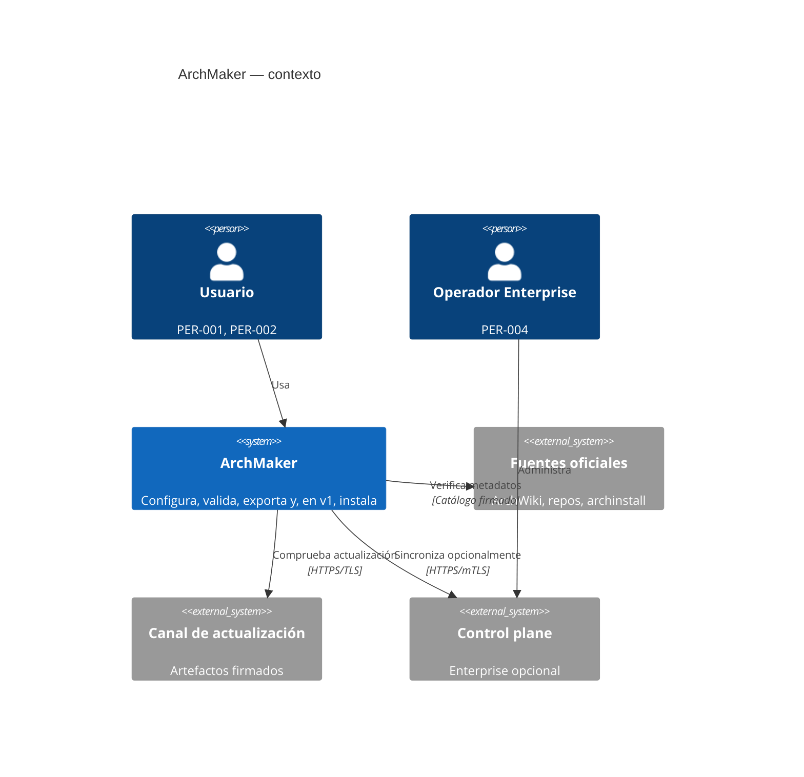
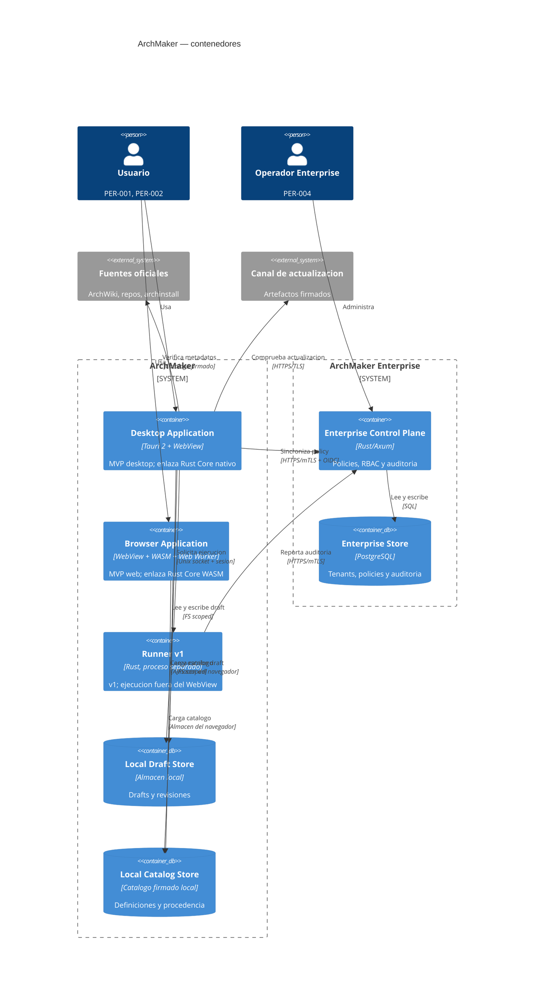

# C4

- ID: DOC-ARCH-C4-001
- Estado: in-review
- Propietario: Arquitectura
- Última revisión: 2026-10-06
- Requisitos relacionados: NFR-PORT-001, NFR-DET-001, NFR-SEC-001, NFR-OFF-001
- Fase: R4 (issues `AUD-007`/`AUD-008`); corrige `AUD-F-08` del `audit-baseline.md`
- Vistas detalladas: [`component-views.md`](component-views.md), [`deployment-views.md`](deployment-views.md), [`runtime-sequences.md`](runtime-sequences.md)
- Viewpoints y concerns: [`../viewpoints.md`](../viewpoints.md), [`../stakeholders-concerns.md`](../stakeholders-concerns.md)

## Propósito y corrección R4

Esta vista describe el sistema ArchMaker en C4. La corrección R4 (`AUD-007`) resuelve la
contradicción `AUD-F-08`: el **`Rust Core` deja de ser un contenedor**. Es un **componente
interno** que se enlaza dentro de los contenedores Desktop Application y Browser Application
mediante los adaptadores Tauri y WASM. La vista previa lo dibujaba como contenedor separado,
contradiciendo su propio deployment.

Los contenedores del sistema son siete: Desktop Application, Browser Application, Runner v1,
Local Draft Store, Local Catalog Store, Enterprise Control Plane y Enterprise Store. El `Rust Core`
aparece como componente en [`component-views.md`](component-views.md), nunca como unidad
desplegable.

## Sistema de interés y frontera

El sistema de interés (SoI) es ArchMaker. Su frontera separa:

- **Producto local:** Desktop Application y Browser Application y sus almacenes locales.
- **Capacidad v1:** Runner v1 como proceso separado (fuera del WebView).
- **Capacidad Enterprise:** Enterprise Control Plane y Enterprise Store (servidor opcional).

## Contexto

## Contenedores

## Contenedores, fronteras y protocolos

| Contenedor | Frontera | Responsabilidad | Se comunica con |
|---|---|---|---|
| Desktop Application | Frontera local (proceso Tauri) | UI, adaptador Tauri y `Rust Core` enlazado. | Usuario, Local Draft Store, Local Catalog Store, Runner v1, Canal de actualización, Control Plane. |
| Browser Application | Frontera local (runtime del navegador) | UI, adaptador WASM y `Rust Core` enlazado. | Usuario, Local Draft Store, Local Catalog Store. |
| Runner v1 | Frontera privilegiada (proceso separado) | Preflight, dry-run, ejecución allowlisted y journal. | Desktop Application, Control Plane. |
| Local Draft Store | Frontera de almacenamiento local | Drafts y revisiones con escritura atómica. | Desktop Application, Browser Application. |
| Local Catalog Store | Frontera de almacenamiento local | Catálogos firmados con digest y procedencia. | Desktop Application, Browser Application. |
| Enterprise Control Plane | Frontera de servidor (Enterprise) | Policies, RBAC, aprobaciones y auditoría. | Operador, Enterprise Store, Desktop Application, Runner v1. |
| Enterprise Store | Frontera de datos (Enterprise) | Tenants, policies y auditoría. | Enterprise Control Plane. |

Cada frontera se cruza por un protocolo nombrado y deny-by-default:

| Frontera | Protocolo | Contrato | ADR |
|---|---|---|---|
| WebView a `Rust Core` en Desktop | Tauri IPC (comandos allowlisted + capability por ventana) | `CorePort` / `tauri-commands` | ADR-0001, ADR-0002 |
| UI a `Rust Core` en Browser | `postMessage` Web Worker + bindings WASM | `CorePort` / `tauri-wasm` | ADR-0001 |
| Desktop a Local Draft Store | Filesystem con scope por selección explícita; escritura atómica | `draft.schema.json`, `saveDraft` con `expectedRevision` | ADR-0002 |
| Desktop a Local Catalog Store | Carga de catálogo firmado y verificación de digest | `catalog.schema.json` | ADR-0008 |
| Browser a almacenes locales | Almacenamiento del navegador sin red | `draft.schema.json`, `catalog.schema.json` | ADR-0002 |
| Desktop a Runner v1 | Unix socket con autenticación de sesión; `protocolVersion` negociada | `runner-protocol` | ADR-0004 |
| Desktop a Canal de actualización | HTTPS/TLS, endpoint en allowlist y firma obligatoria | `updater` | ADR-0009 |
| Desktop/Runner a Control Plane | HTTPS/mTLS + OIDC, superficie `/api/v1` (Enterprise) | `openapi` | ADR-0003 |
| Control Plane a Enterprise Store | SQL | — | — |

## Componentes

El `Rust Core` y su descomposición en crates, junto con los adaptadores Tauri/WASM y el Runner,
se detallan en [`component-views.md`](component-views.md) (VW-03 Desktop, VW-04 Browser,
VW-05 Rust Core, VW-06 Runner). Ninguna crate figura como unidad desplegable.

## Deployments

Las vistas de despliegue por fase —MVP Desktop (VW-07), MVP Web (VW-08), v1 (VW-09) y Enterprise
(VW-10)— están en [`deployment-views.md`](deployment-views.md). El `Rust Core` se enlaza dentro de
los contenedores Desktop/Browser; no se despliega como artefacto independiente.

## Secuencias de runtime

Las secuencias editar, resolver, exportar, actualizar y ejecutar plan están en
[`runtime-sequences.md`](runtime-sequences.md) (VW-11).

## Justificación (rationale)

- El `Rust Core` es autoridad semántica única y se enlaza en ambos productos (ADR-0001); por eso es
  componente, no contenedor.
- La separación Desktop/Browser materializa la portabilidad y la paridad Tauri/WASM
  (`NFR-DET-001`, `NFR-PORT-001`).
- El Runner se separa del WebView por seguridad (ADR-0004).
- Los almacenes locales son contenedores de datos y permiten operación offline (`NFR-OFF-001`).
- El Control Plane es opcional y no forma parte del producto local (ADR-0003).
