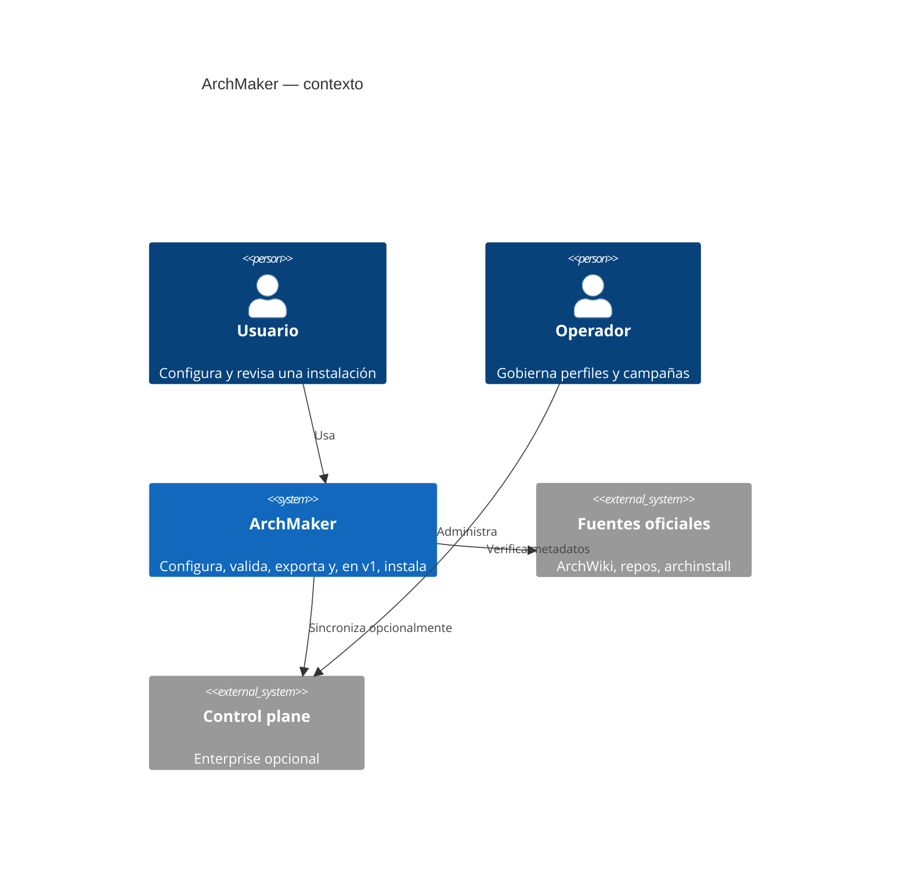
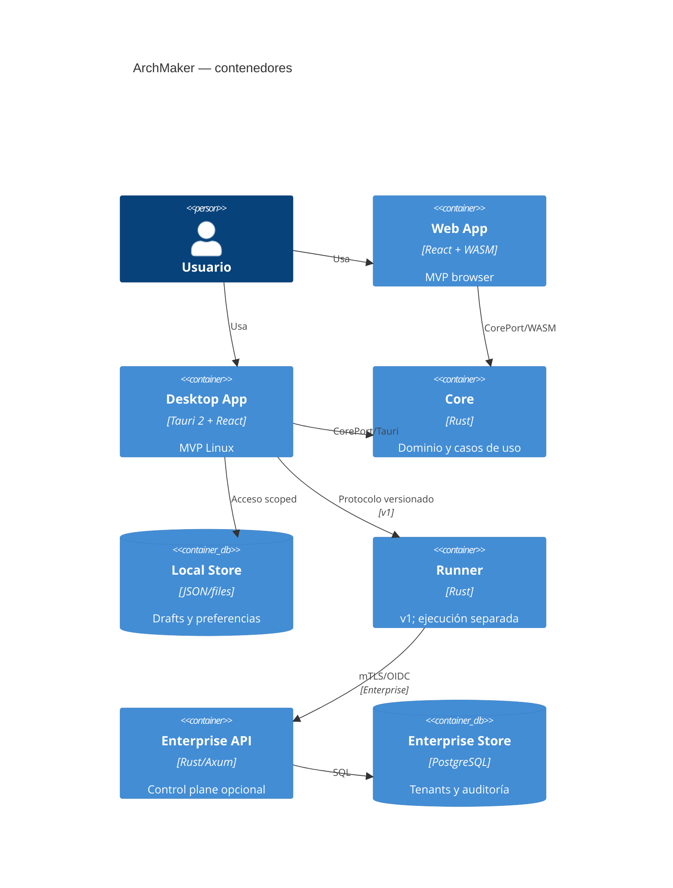
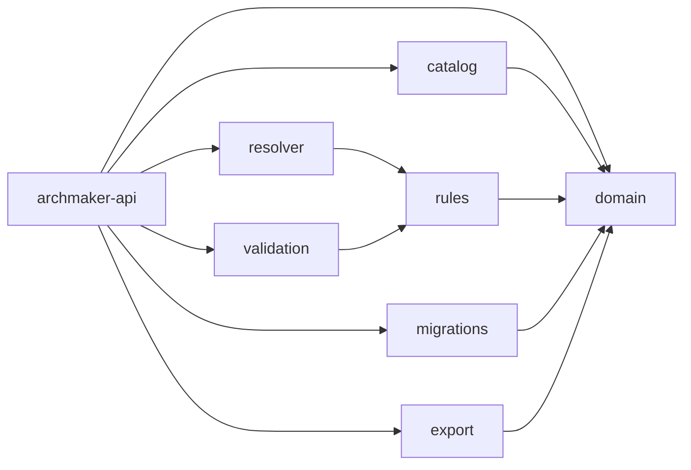

# C4

## Contexto

## Contenedores

## Componentes Core

## Deployments

- MVP web: assets estáticos + WASM + Web Worker, sin backend obligatorio.
- MVP desktop: bundle Tauri con core enlazado y filesystem limitado por picker/scope.
- v1: desktop no privilegiado + runner autenticado/elevado por mecanismo del SO.
- Enterprise: control plane separado; el producto local mantiene modo autónomo.
