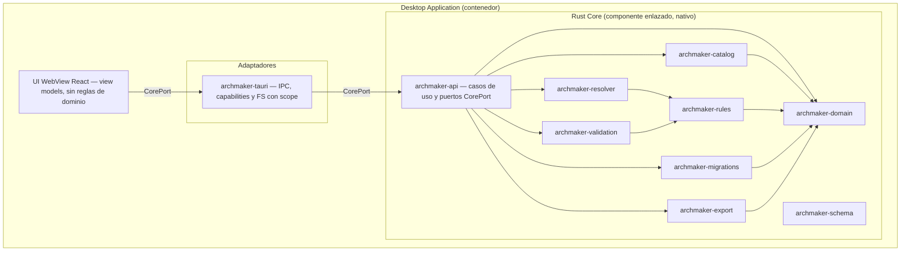
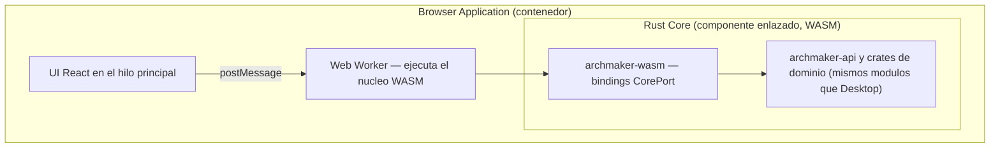
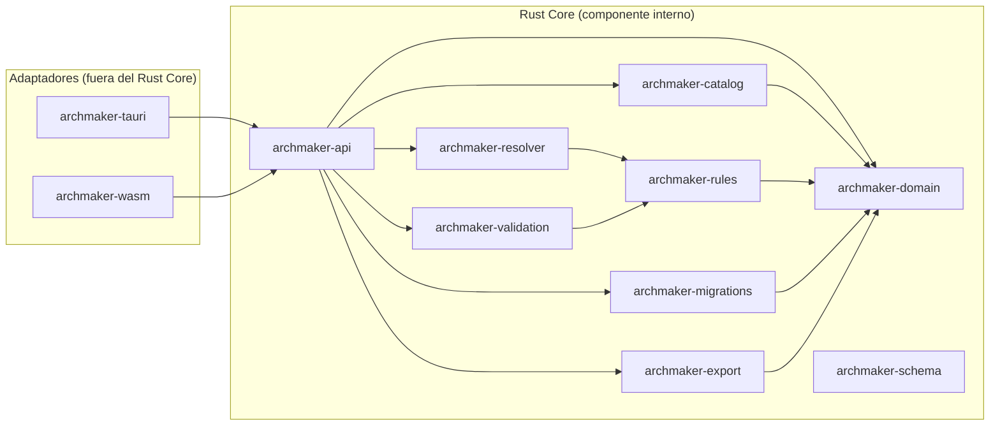
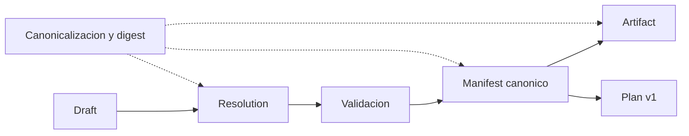
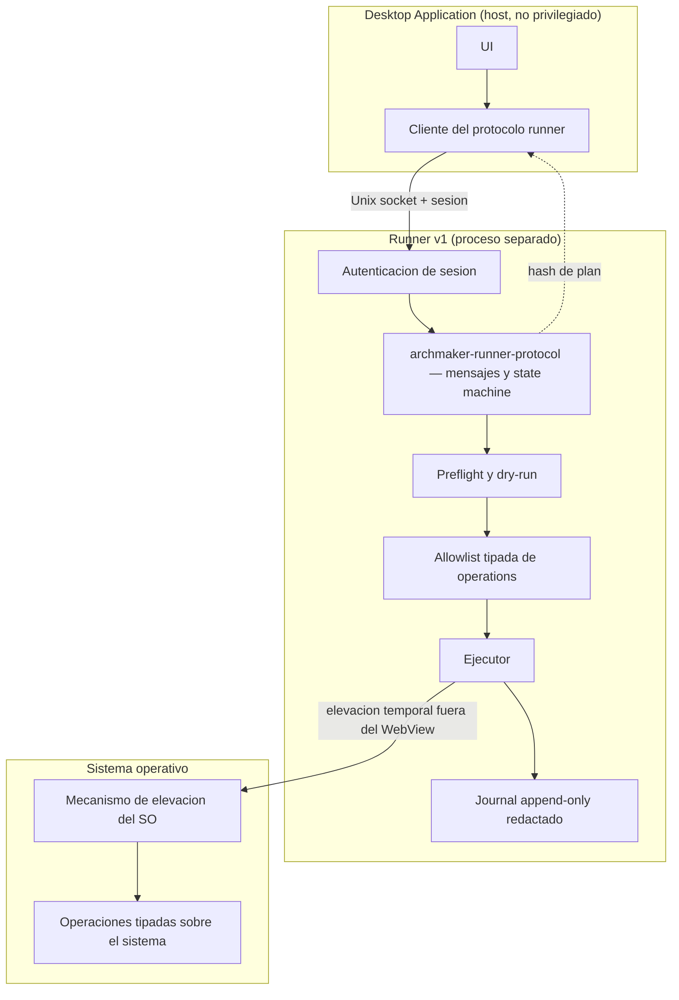

# Vistas de componentes

- ID: DOC-ARCH-C4-CMP-001
- Estado: in-review
- Propietario: Arquitectura
- Fecha: 2026-10-06
- Requisitos relacionados: NFR-PORT-001, NFR-DET-001, NFR-OBS-001
- Viewpoint: VP-03 Componentes ([`../viewpoints.md`](../viewpoints.md))
- Fase: R4; resuelve `AUD-F-08`

## VW-03 — Componentes de Desktop Application

El adaptador `archmaker-tauri` aplica deny-by-default por ventana y scope mínimo de filesystem
(ADR-0002). La UI solo conoce `CorePort` y view models; no reimplementa reglas (ADR-0001).

## VW-04 — Componentes de Browser Application

El mismo `Rust Core` se compila a WASM y se ejecuta en un Web Worker; el bundle es estático y no
requiere backend ni CDN (`NFR-OFF-001`). La paridad semántica con Desktop se verifica por golden
parity (`NFR-DET-001`).

## VW-05 — Componentes de Rust Core

Pipeline canónico de datos:

Reglas de dependencia aplicadas ([`../dependency-rules.md`](../dependency-rules.md)): el grafo es
acíclico, el dominio no conoce infraestructura y los DTO públicos no exponen tipos de
infraestructura. La descomposición a nivel de crate está en
[`../module-map.md`](../module-map.md).

## VW-06 — Componentes de Runner v1

El runner recibe un plan inmutable confirmado por hash y ejecuta solo operaciones allowlisted; el
WebView nunca controla root (ADR-0004, `THR-RUN-001`).

## Inventario de componentes e interfaces

| View | Componente | Tipo | Puerto/interfaz | No puede depender de |
|---|---|---|---|---|
| VW-03 | UI WebView React | Componente de UI | `CorePort` (vía `archmaker-tauri`) | Dominio interno, FS directo |
| VW-03 | `archmaker-tauri` | Adaptador | IPC + capabilities | Runner internals |
| VW-03 | `archmaker-api` | Caso de uso y puertos | `CorePort` | Implementaciones concretas |
| VW-04 | UI React + Web Worker | Componente de UI | `CorePort` (vía `archmaker-wasm`) | FS, red |
| VW-04 | `archmaker-wasm` | Adaptador | Bindings WASM | Tauri |
| VW-05 | `archmaker-domain` | Dominio | Value types y entidades | UI, Tauri, WASM, FS, red |
| VW-05 | `archmaker-schema` | Contratos | Meta-validación | UI/infraestructura |
| VW-05 | `archmaker-catalog` | Dominio de datos | Carga, índice y procedencia | Tauri/UI |
| VW-05 | `archmaker-rules` | Dominio | Evaluación pura | Infraestructura |
| VW-05 | `archmaker-resolver` | Dominio | Capabilities y ChangeSet | UI |
| VW-05 | `archmaker-validation` | Dominio | Pipeline y diagnósticos | UI |
| VW-05 | `archmaker-migrations` | Dominio | Transformaciones puras | Infraestructura mutable |
| VW-05 | `archmaker-export` | Dominio | SPI de targets y artifacts | Tauri |
| VW-06 | `archmaker-runner-protocol` | Contrato | Mensajes y state machine | UI |
| VW-06 | `archmaker-plan` | Modelo | Plan tipado | Ejecución |

**Ninguna crate es una unidad desplegable.** Todas son componentes enlazados dentro de los
contenedores; el detalle de artefactos está en [`deployment-views.md`](deployment-views.md).

## Boundaries nombrados

| Boundary | Incluye | Excluye |
|---|---|---|
| Desktop Application | UI, adaptador Tauri, `Rust Core` nativo | Runner, almacenes |
| Browser Application | UI, Web Worker, `Rust Core` WASM | Backend, red |
| Rust Core (componente) | Crates de dominio y `archmaker-api` | Adaptadores e infraestructura |
| Runner v1 | Protocolo, preflight, allowlist, ejecutor, journal | WebView y UI |
