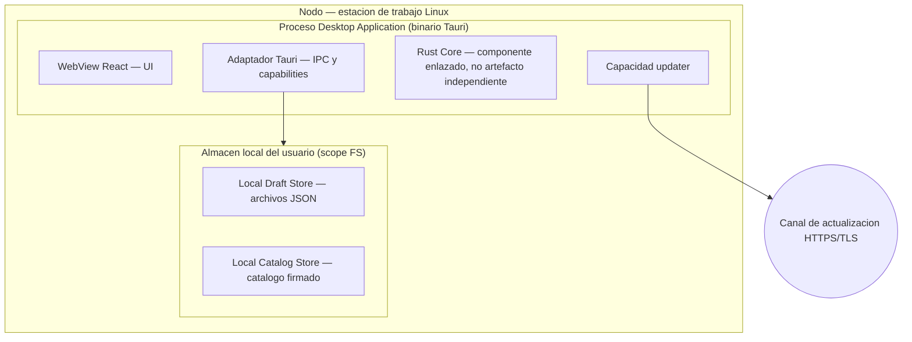
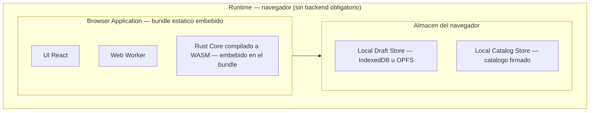
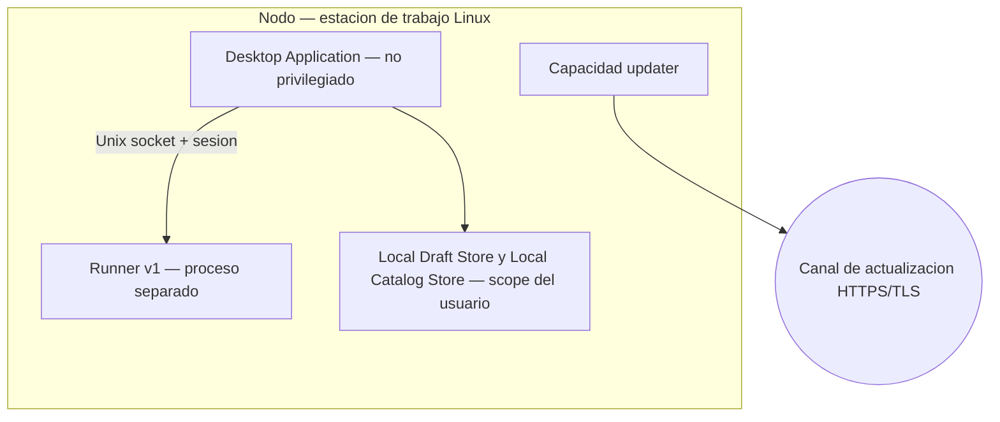
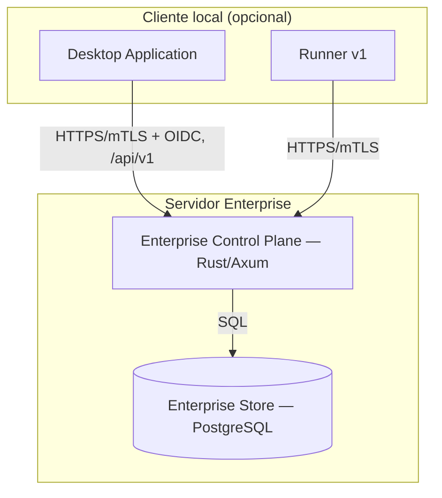

# Vistas de deployment

- ID: DOC-ARCH-C4-DEP-001
- Estado: in-review
- Propietario: Arquitectura
- Fecha: 2026-10-06
- Requisitos relacionados: NFR-SEC-001, NFR-OFF-001
- Viewpoint: VP-04 Deployment ([`../viewpoints.md`](../viewpoints.md))
- Fase: R4; resuelve `AUD-F-08`

## VW-07 — Deployment MVP Desktop

Sin Runner ni backend. El filesystem se concede por selección explícita del usuario y el updater
es fail-open offline (ADR-0002, ADR-0009). `Rust Core` se enlaza de forma nativa dentro del
proceso Desktop.

## VW-08 — Deployment MVP Web

El bundle es estático y no contacta CDN ni servidor; el módulo WASM forma parte del bundle y no se
despliega por separado (`NFR-OFF-001`).

## VW-09 — Deployment v1

El runner se eleva temporalmente mediante un mecanismo del SO, fuera del WebView (ADR-0004). El
host permanece no privilegiado.

## VW-10 — Deployment Enterprise

El control plane es opcional y no forma parte del producto local; el producto mantiene modo
autónomo y offline (ADR-0003).

## Inventario de artefactos desplegables

| Artefacto desplegable | Contenedor | Fase | Naturaleza |
|---|---|---|---|
| Binario Desktop Application | Desktop Application | MVP, v1 | Proceso; enlaza `Rust Core` nativo. |
| Bundle estático Browser Application | Browser Application | MVP | Assets + módulo WASM embebido. |
| Ejecutable Runner v1 | Runner v1 | v1 | Proceso separado con elevación temporal. |
| Servicio Enterprise Control Plane | Enterprise Control Plane | Enterprise | Servicio de servidor. |
| Base de datos Enterprise Store | Enterprise Store | Enterprise | Almacén PostgreSQL. |
| Local Draft Store | Local Draft Store | MVP | Datos en scope del usuario o almacén del navegador. |
| Local Catalog Store | Local Catalog Store | MVP | Catálogo firmado local. |

## Componentes enlazados (no desplegables)

| Componente | Contenedor anfitrión | Enlace |
|---|---|---|
| `Rust Core` | Desktop Application | Biblioteca nativa enlazada. |
| `Rust Core` | Browser Application | Módulo WASM embebido en el bundle. |
| Adaptador `archmaker-tauri` | Desktop Application | Enlazado en el binario. |
| Adaptador `archmaker-wasm` | Browser Application | Enlazado en el módulo WASM. |

**Ninguna librería o crate figura como unidad desplegable**; todas se enlazan dentro de un
contenedor. `Rust Core` es un componente interno, no un contenedor (`AUD-F-08`).

## Matriz de entorno

| Vista | Red | Filesystem | Privilegio |
|---|---|---|---|
| VW-07 MVP Desktop | Solo updater, fail-open offline | Scope por selección explícita | Usuario |
| VW-08 MVP Web | Ninguna | Almacén del navegador | Usuario del navegador |
| VW-09 v1 | Updater | Scope del usuario y operaciones del runner | Usuario + elevación temporal del runner |
| VW-10 Enterprise | HTTPS/mTLS + OIDC (opcional) | Servidor | Servicio y usuario |
