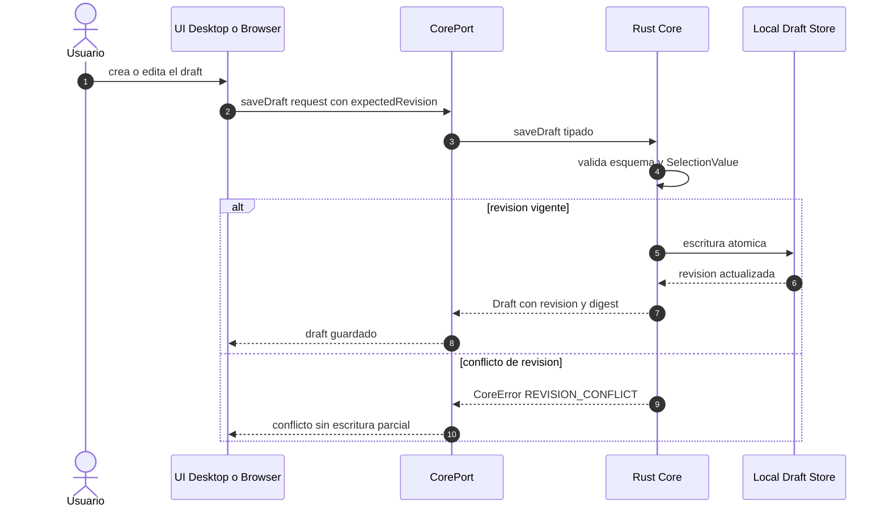
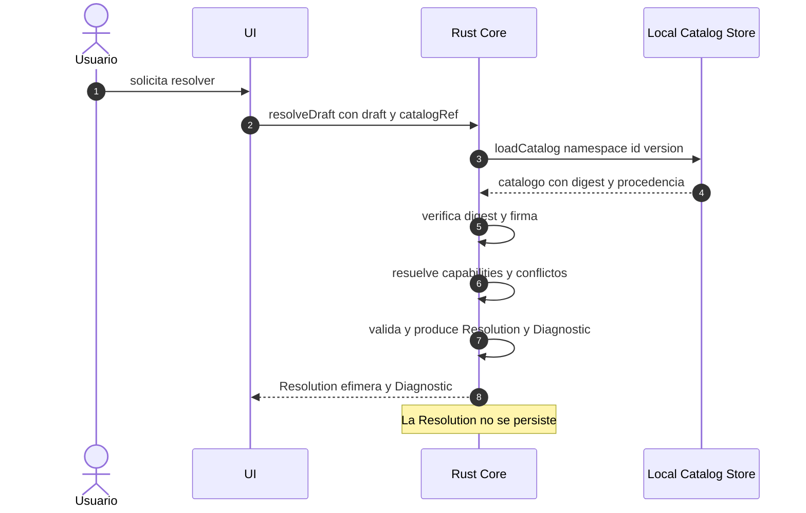
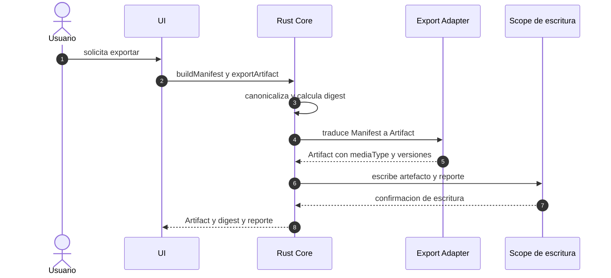
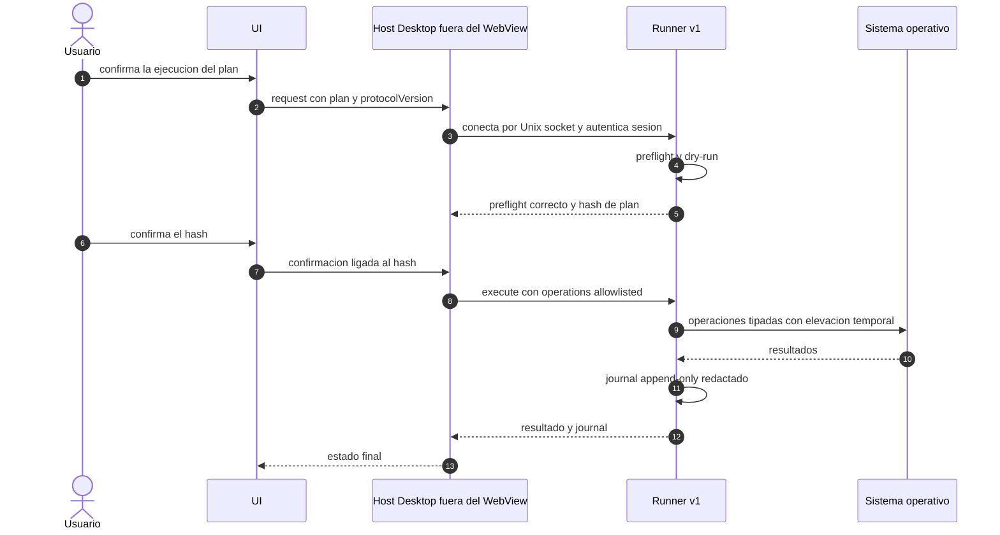

# Secuencias de runtime

- ID: DOC-ARCH-C4-SEQ-001
- Estado: in-review
- Propietario: Arquitectura
- Fecha: 2026-10-06
- Requisitos relacionados: FR-DRAFT-001, FR-RESOLVE-001, FR-VALIDATE-001, FR-MANIFEST-001, FR-EXPORT-001, FR-RUN-001, NFR-DET-001
- Viewpoint: VP-05 Interacción y runtime ([`../viewpoints.md`](../viewpoints.md))
- Fase: R4

## Secuencia — Editar y guardar draft

Precondición: catálogo cargado. Postcondición: draft persistido con `expectedRevision` verificado;
ante conflicto o error de E/S, el draft previo permanece intacto (`FR-DRAFT-001`).

## Secuencia — Resolver

La resolución es determinista e idempotente; un conflicto bloqueante impide construir el manifest
(`FR-RESOLVE-001`, `FR-VALIDATE-001`, `NFR-DET-001`).

## Secuencia — Exportar

Un target no soportado o un fallo de escritura parcial no produce artefacto válido a medias
(`FR-MANIFEST-001`, `FR-EXPORT-001`).

## Secuencia — Actualizar

```mermaid
sequenceDiagram
  autonumber
  participant DESK as Desktop Application
  participant UPD as Updater
  participant NET as Canal de actualizacion
  participant APP as Producto local
  DESK->>UPD: comprueba actualizacion
  alt sin red
    UPD-->>DESK: fail-open, la app sigue operativa
  else con red
    UPD->>NET: solicita manifiesto firmado
    NET-->>UPD: manifiesto y firma
    UPD->>UPD: verifica firma y allowlist del endpoint
    alt firma valida
      UPD->>APP: aplica actualizacion
      APP-->>UPD: aplicada con rollback disponible
    else firma invalida
      UPD-->>DESK: rechaza, no se aplica
    end
  end
```

Sin red la aplicación arranca y opera con normalidad; la actualización nunca bloquea el uso
(`NFR-OFF-001`, ADR-0009).

## Secuencia — Ejecutar plan

Un hash de confirmación distinto o un cambio de inventario rechaza la ejecución; el WebView nunca
ejecuta operaciones privilegiadas (ADR-0004, `FR-RUN-001`).
