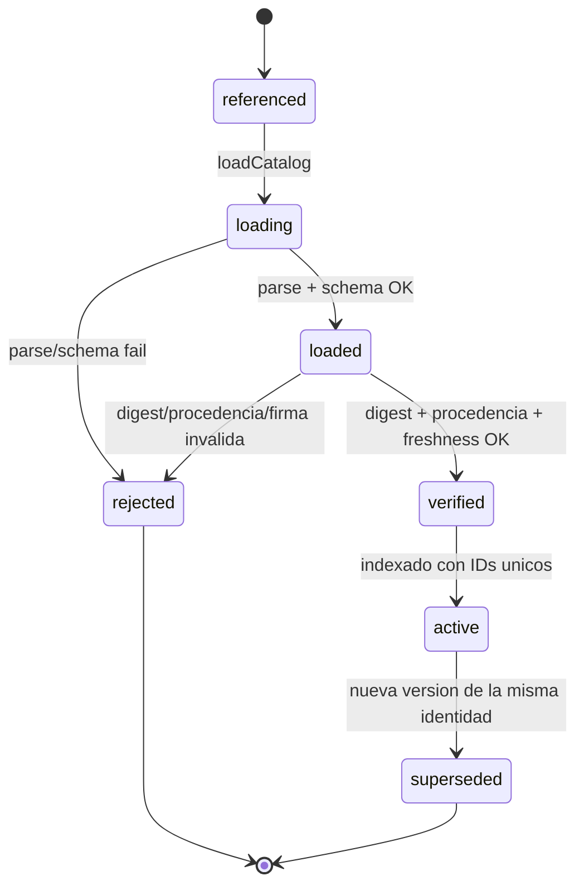
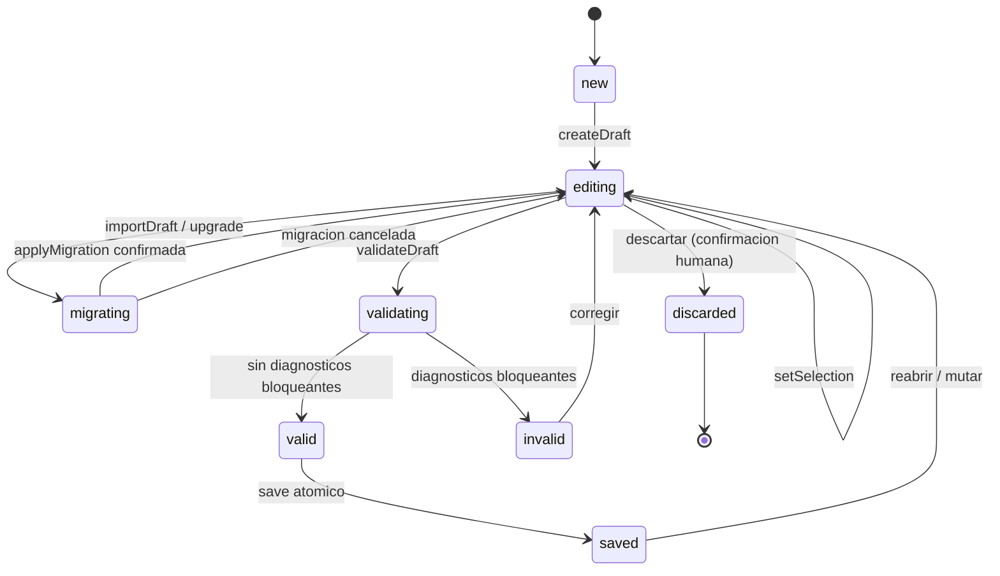
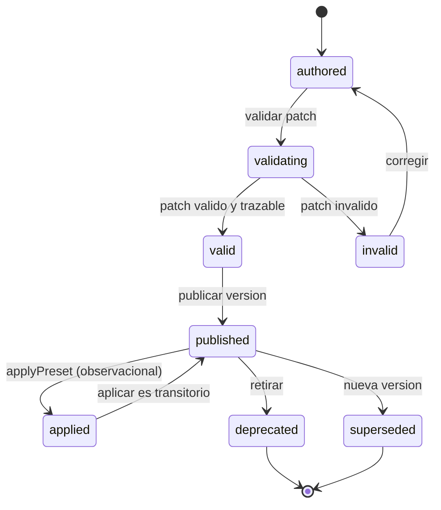
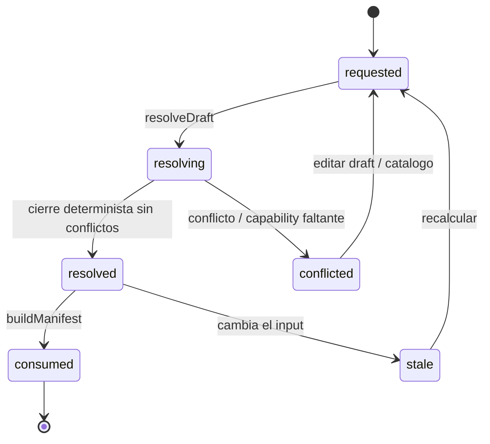
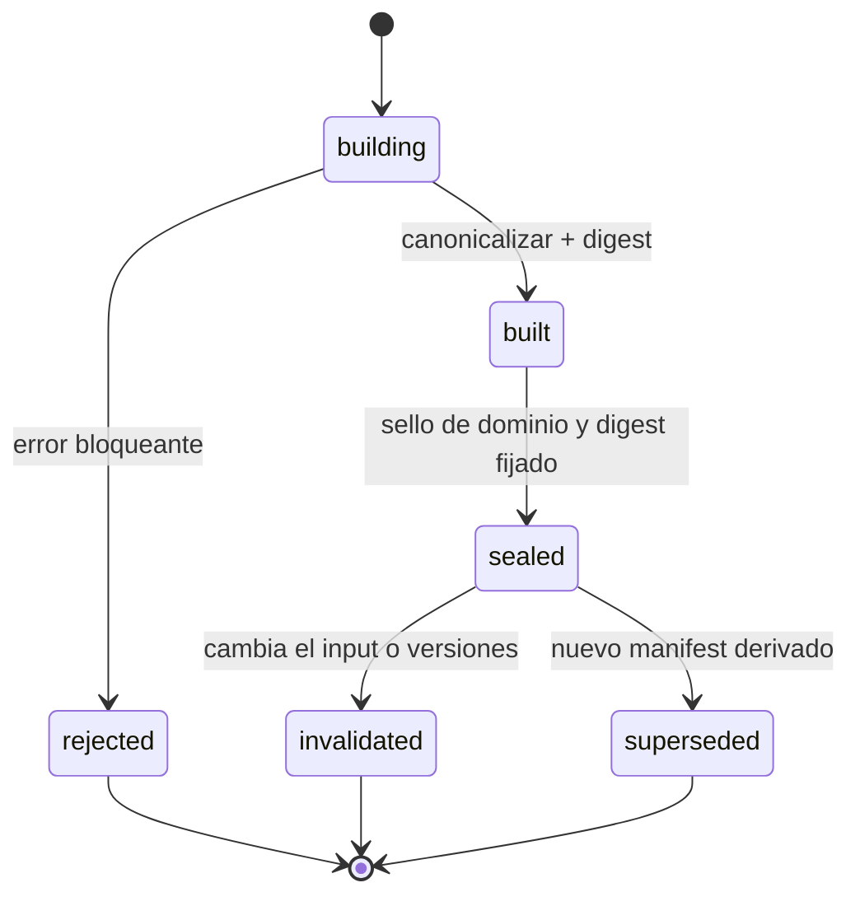
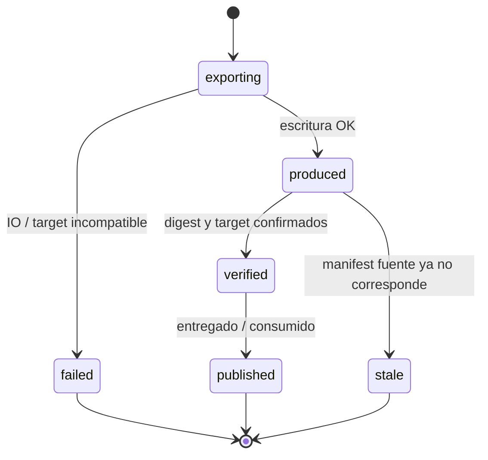
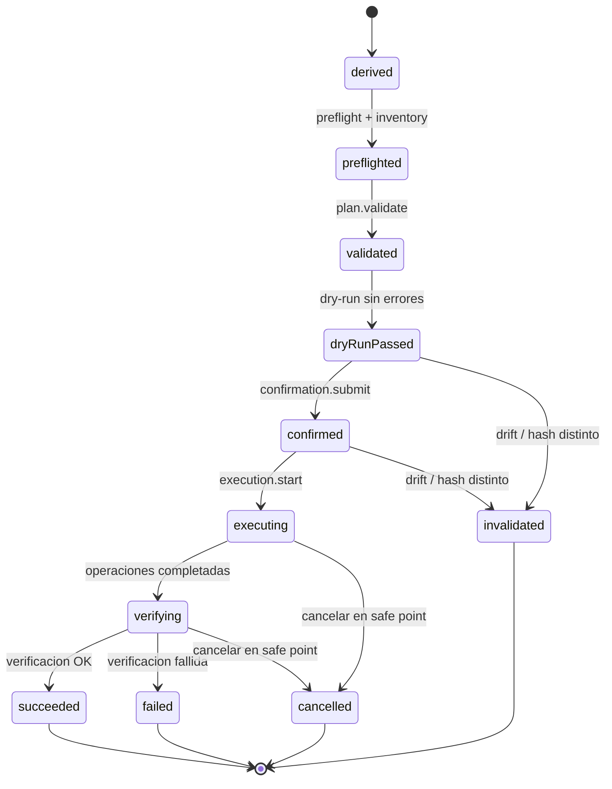
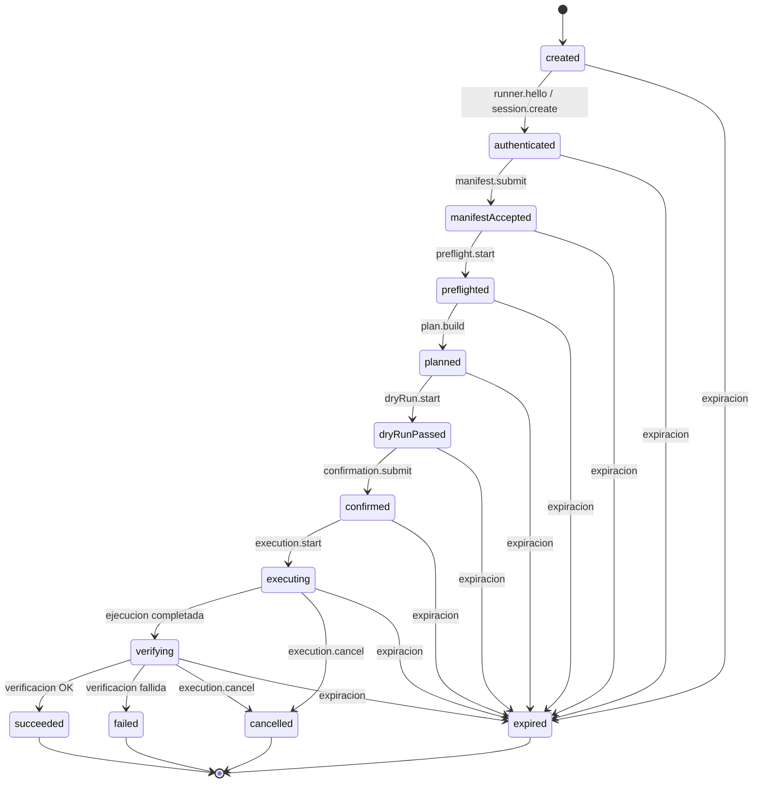
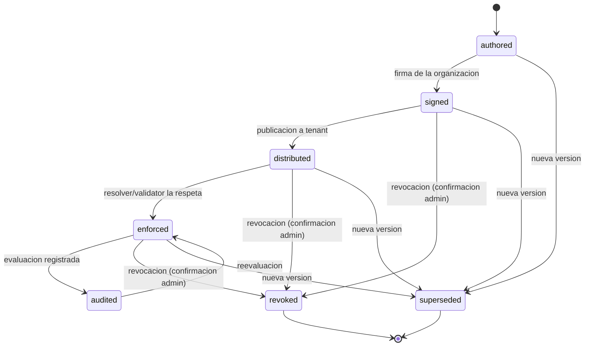

# Ciclos de vida de agregados

- ID: DOC-DATA-LIFE-001
- Estado: draft
- Propietario: Arquitectura de datos
- Última revisión: 2026-10-05
- Requisitos relacionados: FR-DRAFT-001, FR-VALIDATE-001, FR-MANIFEST-001, FR-RUN-001, NFR-DET-001, NFR-MIG-001
- Sustituye / sustituido por: —

## Alcance y convenciones

Este documento describe el ciclo de vida de los nueve agregados de `domain-model.md`: `DM-CATALOG`, `DM-DRAFT`, `DM-PRESET`, `DM-RESOLUTION`, `DM-MANIFEST`, `DM-ARTIFACT`, `DM-PLAN`, `DM-SESSION`, `DM-POLICY`.

Convenciones:

- Los nombres de estado son estados lógicos de agregado, no estados de UI.
- Las transiciones se anotan como **origen → evento → destino**, con guarda/invariante y efecto observable.
- Los eventos se nombran según `errors-events.md`; si una transición no tiene evento dedicado en el catálogo vigente se marca como **gap de evento**.
- `DM-CATALOG`, `DM-PRESET`, `DM-MANIFEST`, `DM-ARTIFACT`, `DM-PLAN` y `DM-POLICY` son inmutables: su ciclo de vida es de *versión* (creación, sello, invalidación, sustitución), no de mutación in-place.
- `DM-DRAFT` es el único agregado editable; `DM-RESOLUTION` es efímera y nunca se persiste como verdad; `DM-SESSION` es el único agregado con estado mutable persistido de ejecución.
- Fases según glosario: `DM-DRAFT`, `DM-CATALOG`, `DM-PRESET` son producto/local; `DM-POLICY` es Enterprise; `DM-PLAN` y `DM-SESSION` (Runner) son v1.

> Nota: los estados propuestos para `DM-CATALOG`, `DM-PRESET`, `DM-ARTIFACT` y `DM-POLICY` no están fijados en documentos previos; se **derivan** de invariantes de `domain-model.md`, de los pasos del pipeline (`pipeline.md`) y de las operaciones de `CorePort` (`core-port.md`). Ver «Fuentes primarias pendientes».

---

## DM-CATALOG — Catalog

Agregado inmutable e indexable. El ciclo es de carga y verificación, no de edición.

| Origen | Evento | Destino | Guarda / invariante | Efecto observable |
|---|---|---|---|---|
| `referenced` | `loadCatalog` | `loading` | Límites de bytes/profundidad/colecciones (pipeline 1). | `core.operation.started`; lectura del catálogo. |
| `loading` | parse + meta-schema + schema estructural OK (pipeline 2–5) | `loaded` | UTF-8 sin BOM; serialización canónica. | Digest calculado; estructura en memoria. |
| `loading` | parse/schema falla | `rejected` | Terminal. | `CoreError` (`AM-DOC`, `AM-SCHEMA`). |
| `loaded` | digest + procedencia + firma + freshness OK (pipeline 11) | `verified` | Requisito de carga, no opción de UI (**ADR-0008**); sujeto a política de firma (**DEC-006** pendiente). | `catalog.loaded`. |
| `loaded` | digest, procedencia o firma inválida | `rejected` | Terminal. | `CoreError` `AM-CAT-003` (`error.catalog.signatureInvalid`). |
| `verified` | indexado | `active` | IDs únicos; integridad referencial (pipeline 6). | Definiciones y capabilities disponibles para el resolver. |
| `active` | nueva versión de la misma identidad `namespace/id` | `superseded` | `catalogRef.version` superior. | El catálogo anterior queda de solo lectura; `core.operation.completed`. |
| `active` | error de dominio en un `Rule` referenciado | `rejected` | Terminal (el catálogo entero no se activa). | Diagnóstico bloqueante; `AM-RULE`. |

- **Estado inicial:** `referenced`.
- **Estados terminales:** `rejected`, `superseded`.
- **Persistido (inmutable):** bytes canónicos, digest, procedencia/evidencias y `namespace/id/version`.
- **Efímero:** índice en memoria, diagnósticos de validación, caché de evaluación.
- **Relacionado:** `ADR-0008` (procedencia verificable como requisito de carga; firma supeditada a **DEC-006**).

---

## DM-DRAFT — Draft

Único agregado mutado por la UI. Solo contiene intención manual y referencias.

| Origen | Evento | Destino | Guarda / invariante | Efecto observable |
|---|---|---|---|---|
| `[*]` | `createDraft` | `new` | Identidad `UUID`. | Draft vacío en memoria. |
| `new` | `createDraft`/abrir | `editing` | — | UI habilita edición. |
| `editing` | `setSelection` | `editing` | Solo intención manual y refs (`SelectionValue`); nunca estado derivado. | `draft.changed`; Resolution previa pasa a *stale*. |
| `editing` | `importDraft`/upgrade | `migrating` | Versión distinta detectada. | `core.operation.started`; se construye `MigrationPlan`. |
| `migrating` | `applyMigration` | `editing` | `MigrationPlan` mostrado y confirmado; original conservado (**NFR-MIG-001**, confirmación humana). | Nuevo documento; informe preserved/transformed/dropped/rejected. |
| `migrating` | cancelar/rechazar | `editing` | — | Sin cambios; original intacto. |
| `editing` | `validateDraft` | `validating` | Límites de input. | `core.operation.started`. |
| `validating` | pipeline sin bloqueos | `valid` | `FR-VALIDATE-001`; diagnósticos tipados y localizados. | `validation.completed`. |
| `validating` | diagnóstico `blocking: true` | `invalid` | — | `validation.completed`; `Diagnostic` por `path`. |
| `invalid` | edición | `editing` | Cambio en la causa del bloqueo. | `draft.changed`. |
| `valid` | `save` | `saved` | Escritura atómica (**FR-DRAFT-001**). | Round-trip sin pérdida; documento persistido. |
| `saved` | reabrir/mutar | `editing` | — | `draft.changed`. |
| `editing` | descartar | `discarded` | Confirmación humana explícita. | Terminal; el documento se elimina. |

- **Estado inicial:** `new`.
- **Estado terminal:** `discarded`.
- **Persistido:** documento Draft (`UUID`, selecciones, referencias), escrito atómicamente.
- **Efímero:** `Resolution` asociada, `ChangeSet`, estado de UI y flags `valid`/`invalid` (recomputables, **NFR-DET-001**).
- **Nota:** aplicar un `Preset` no sustituye silenciosamente el Draft ni transita este agregado; produce un `ChangeSet` (ver DM-PRESET y `FR-PRESET-001`).

---

## DM-PRESET — Preset

Patch nombrado, versionado e inmutable. Aplicarlo no lo muta.

| Origen | Evento | Destino | Guarda / invariante | Efecto observable |
|---|---|---|---|---|
| `[*]` | — | `authored` | Identidad `namespace/id/version`. | Documento de preset creado. |
| `authored` | validación | `validating` | Límites y schema. | `core.operation.started`. |
| `validating` | patch válido y trazable | `valid` | Invariante DM-PRESET. | Diagnósticos no bloqueantes. |
| `validating` | patch inválido | `invalid` | — | Diagnóstico bloqueante. |
| `invalid` | edición | `authored` | — | Sin cambios persistidos. |
| `valid` | publicar versión | `published` | Versión inmutable. | Preset disponible para `applyPreset`. |
| `published` | `applyPreset(draft)` | `applied` | Estado **observacional**; el preset no se muta. | `ChangeSet`; `resolution.changed`. |
| `applied` | — | `published` | Transitorio. | El Draft registra el cambio. |
| `published` | retirar | `deprecated` | Terminal. | No seleccionable en nuevas aplicaciones. |
| `published` | nueva versión | `superseded` | Terminal. | — |

- **Estado inicial:** `authored`.
- **Estados terminales:** `deprecated`, `superseded`.
- **Persistido (inmutable):** patch versionado e identidad `namespace/id/version`.
- **Efímero:** `ChangeSet` producido por `applyPreset`/`compareDrafts`; `applied` no es un estado persistido del preset.

---

## DM-RESOLUTION — Resolution

Resultado determinista y efímero de resolver un Draft contra un Catalog. Nunca se persiste como verdad.

| Origen | Evento | Destino | Guarda / invariante | Efecto observable |
|---|---|---|---|---|
| `[*]` | — | `requested` | Draft y Catalog disponibles. | — |
| `requested` | `resolveDraft` | `resolving` | Determinista e idempotente (**FR-RESOLVE-001**, **NFR-DET-001**). | `core.operation.started`. |
| `resolving` | cierre sin conflictos bloqueantes | `resolved` | Cierre de capabilities y conflictos (pipeline 9). | `resolution.changed`; selección efectiva. |
| `resolving` | conflicto o capability faltante | `conflicted` | — | `Diagnostic` `AM-RES-004` (`diagnostic.capabilityMissing`). |
| `conflicted` | editar draft/catálogo | `requested` | — | Se invalida la resolución previa. |
| `resolved` | `buildManifest` | `consumed` | Resolution sin bloqueos (**FR-MANIFEST-001**). | Entrada al manifiesto. |
| `resolved` | cambio de draft, `catalogRef.version` o reglas | `stale` | Cambia el input. | `resolution.changed`. |
| `stale` | recalcular | `requested` | — | — |

- **Estado inicial:** `requested`.
- **Estado terminal:** `consumed` (la Resolution se descarta tras alimentar el Manifest).
- **Persistido:** nada. Identidad = digest de input; recalculable.
- **Efímero:** todo el agregado: selección efectiva, capabilities aportadas/requeridas, derivaciones y conflictos.

---

## DM-MANIFEST — Manifest

Documento canónico, cerrado, ordenado y hasheado que materializa una Resolution sin bloqueos.

| Origen | Evento | Destino | Guarda / invariante | Efecto observable |
|---|---|---|---|---|
| `[*]` | `buildManifest` | `building` | Resolution sin bloqueos. | `core.operation.started` (**gap de evento**: no hay `manifest.*` dedicado). |
| `building` | canonicalización + digest (pipeline 13–14) | `built` | Serialización canónica; campos efímeros fuera del payload. | Digest calculado. |
| `building` | error bloqueante | `rejected` | `FR-MANIFEST-001`: imposible con errores bloqueantes. | Terminal; `Diagnostic` bloqueante. |
| `built` | sello de dominio `archmaker:manifest:v1` | `sealed` | Etiqueta de dominio y digest fijos. | El manifest queda cerrado e inmutable. |
| `sealed` | cambio de Draft/Resolution/`catalogRef.version`/procedencia | `invalidated` | El digest de input deja de corresponder. | Terminal; debe reconstruirse. |
| `sealed` | nuevo manifest derivado | `superseded` | — | Terminal; el anterior se conserva inmutable. |

- **Estado inicial:** `building`.
- **Estados terminales:** `rejected`, `invalidated`, `superseded`.
- **Persistido (inmutable):** manifest canónico y digest; es la entrada de los exporters y del plan v1.
- **Efímero:** buffer de construcción y diagnósticos de canonicalización.
- **Relacionado:** `ADR-0007` (canonicalización, SHA-256 con etiqueta de dominio y exclusión de campos efímeros).

---

## DM-ARTIFACT — Artifact

Salida material de un exporter; declara target, productor, versiones, `mediaType` y digests.

| Origen | Evento | Destino | Guarda / invariante | Efecto observable |
|---|---|---|---|---|
| `[*]` | `exportArtifact` | `exporting` | Manifest `sealed`; target soportado (ver **DEC-001**). | `core.operation.started`. |
| `exporting` | escritura correcta | `produced` | Digest y `mediaType` calculados. | `artifact.created`. |
| `exporting` | fallo de IO o target incompatible | `failed` | Terminal. | `CoreError` `AM-IO` / `AM-TGT`. |
| `produced` | verificación de digest y target | `verified` | Coincide con el manifest fuente. | Artifact utilizable. |
| `produced` | el manifest fuente cambia | `stale` | Terminal para esa instancia. | Debe re-exportarse. |
| `verified` | entrega / consumo | `published` | Terminal. | — |

- **Estado inicial:** `exporting`.
- **Estados terminales:** `failed`, `published`, `stale`.
- **Persistido (inmutable):** archivo de salida, digest, `mediaType`, target y versiones del productor.
- **Efímero:** progreso de exportación.
- **Relacionado:** `ADR-0003` (modelo canónico separado del target; cada target es un adapter versionado).

---

## DM-PLAN — InstallationPlan

Secuencia ordenada e inmutable de operaciones tipadas derivada de un Manifest. Fase v1.

| Origen | Evento | Destino | Guarda / invariante | Efecto observable |
|---|---|---|---|---|
| `[*]` | `plan.build` | `derived` | Manifest `sealed`; operaciones tipadas y ordenadas. | `plan.*`; plan inmutable con `UUID` + hash de manifest. |
| `derived` | `preflight.start` + `inventory.read` | `preflighted` | Entorno compatible. | `runner.preflight.*`; snapshot de entorno. |
| `preflighted` | `plan.validate` | `validated` | Prechequeos y precondiciones. | `plan.*`. |
| `validated` | `dryRun.start` | `dryRunPassed` | Dry-run sin errores. | Log de dry-run. |
| `dryRunPassed` | `confirmation.submit` | `confirmed` | **Confirmación humana**; plan hash y manifest hash ligados. | Plan aprobado (ver **FR-RUN-001**). |
| `confirmed` | `execution.start` | `executing` | Sesión `confirmed`; allowlist de operaciones. | `execution.*`. |
| `executing` | operaciones completadas | `verifying` | — | Verificación posterior. |
| `verifying` | verificación OK | `succeeded` | Terminal. | `journal.*`. |
| `verifying` | verificación fallida | `failed` | Terminal. | Diagnóstico; journal conservado. |
| `executing`/`verifying` | `execution.cancel` | `cancelled` | Solo en *safe points*. | Terminal; journal conservado. |
| `dryRunPassed`/`confirmed` | drift de entorno, versión o cambio de hash | `invalidated` | El plan deja de corresponder al manifest/entorno. | Terminal; debe re-derivarse. |

- **Estado inicial:** `derived`.
- **Estados terminales:** `succeeded`, `failed`, `cancelled`, `invalidated`.
- **Persistido (inmutable):** plan (`UUID` + hash de manifest) con operaciones `enum` tipadas y ordenadas.
- **Efímero:** snapshot de preflight, log de dry-run y buffers de mensajes.
- **Relacionado:** `ADR-0004` (runner como proceso separado, transporte y elevación fuera del WebView, estado `proposed`); el transporte definitivo depende de **DEC-004**.

---

## DM-SESSION — RunnerSession

Agregado con estado mutable persistido. Refleja la *state machine* de `runner-protocol.md`.

| Origen | Evento | Destino | Guarda / invariante | Efecto observable |
|---|---|---|---|---|
| `[*]` | `session.create` | `created` | Identidad `UUID`/`nonce`; expiración definida. | Sesión creada. |
| `created` | `runner.hello` | `authenticated` | Nonce, identidad peer y expiración verificados. | Sesión autenticada. |
| `authenticated` | `manifest.submit` | `manifestAccepted` | `protocolVersion` negociado y compatible. | Manifest aceptado. |
| `manifestAccepted` | `preflight.start` + `inventory.read` | `preflighted` | Entorno inventoriable. | `runner.preflight.*`. |
| `preflighted` | `plan.build` | `planned` | Plan tipado construido. | `plan.*`. |
| `planned` | `dryRun.start` | `dryRunPassed` | Dry-run sin errores. | Log de dry-run. |
| `dryRunPassed` | `confirmation.submit` | `confirmed` | **Confirmación humana**; plan hash y manifest hash ligados. | Plan confirmado. |
| `confirmed` | `execution.start` | `executing` | Allowlist de operaciones compiladas. | `execution.*`. |
| `executing` | operaciones completadas | `verifying` | — | Verificación posterior. |
| `verifying` | verificación OK | `succeeded` | Terminal. | `journal.export` disponible. |
| `verifying` | verificación fallida | `failed` | Terminal. | Journal conservado. |
| `executing`/`verifying` | `execution.cancel` | `cancelled` | Solo en *safe points*. | Terminal. |
| cualquiera | expiración / timeout | `expired` | Terminal (derivado de la regla de expiración de `runner-protocol.md`). | Sesión cerrada. |
| `succeeded`/`failed`/`cancelled` | `session.close` | `[*]` | — | Journal append-only final. |

- **Estado inicial:** `created`.
- **Estados terminales:** `succeeded`, `failed`, `cancelled`, `expired`.
- **Persistido:** estado de sesión, `nonce` y journal append-only redactado (v1).
- **Efímero:** identidad peer en memoria y buffers de mensaje.
- **Nota:** el estado `expired` se **deriva** de la regla de expiración de `runner-protocol.md`; no aparece nombrado en la secuencia canónica de ese documento.
- **Relacionado:** `ADR-0004` (sesión autenticada, confirmación destructiva que expira y se liga a hashes, cancelación solo en *safe points*); el transporte depende de **DEC-004**.

---

## DM-POLICY — PolicyBundle

Restricción organizacional firmada. Fase Enterprise.

| Origen | Evento | Destino | Guarda / invariante | Efecto observable |
|---|---|---|---|---|
| `[*]` | — | `authored` | Identidad `namespace/id/version`. | Bundle en control plane Enterprise. |
| `authored` | firma | `signed` | Clave de la organización (**DEC-006** pendiente). | Firma `signature` presente. |
| `signed` | publicación | `distributed` | Aislamiento por tenant. | Bundle disponible al tenant. |
| `distributed` | evaluación en resolver/validator | `enforced` | Acciones `allow`/`deny`/`require`/`lock` respetadas. | `AM-POL` en caso de violación. |
| `enforced` | registro de evaluación | `audited` | Evaluación auditada (invariante DM-POLICY). | Traza de auditoría. |
| `audited` | reevaluación | `enforced` | — | — |
| `signed`/`distributed`/`enforced` | revocación | `revoked` | **Confirmación humana de admin**. | Terminal. |
| cualquiera | nueva versión | `superseded` | Terminal. | La versión anterior queda inactiva. |

- **Estado inicial:** `authored`.
- **Estados terminales:** `revoked`, `superseded`.
- **Persistido (inmutable):** bundle firmado `namespace/id/version/signature`.
- **Efímero:** resultados de evaluación y trazas de auditoría en memoria.
- **Relacionado:** `ADR-0008` (firma y procedencia; **DEC-006** pendiente).
- **Nota:** fase Enterprise; no se mezcla con el producto local (glosario, regla 4).

---

## Reglas transversales

### 1. Transiciones que emiten evento

Los nombres proceden de `errors-events.md`. Cuando no existe evento dedicado se marca **gap**.

| Familia de transición | Evento | Agregados |
|---|---|---|
| Inicio/fin de operación larga | `core.operation.started`, `core.operation.progress`, `core.operation.completed` | Todos |
| Carga de catálogo | `catalog.loaded` | DM-CATALOG |
| Mutación de intención | `draft.changed` | DM-DRAFT, DM-PRESET (vía `applyPreset`) |
| Cálculo de resolución | `resolution.changed` | DM-RESOLUTION, DM-DRAFT (stale) |
| Fin de pipeline | `validation.completed` | DM-DRAFT |
| Construcción de salida | `artifact.created` | DM-ARTIFACT |
| v1: preflight | `runner.preflight.*` | DM-PLAN, DM-SESSION |
| v1: plan | `plan.*` | DM-PLAN, DM-SESSION |
| v1: ejecución | `execution.*` | DM-PLAN, DM-SESSION |
| v1: journal | `journal.*` | DM-PLAN, DM-SESSION |
| Construcción de manifest | **gap**: no hay `manifest.*`; se observa vía `core.operation.completed` | DM-MANIFEST |
| Firma/revocación de política | **gap**: no hay `policy.*` en el catálogo actual | DM-POLICY |

Toda transición de fallo usa `CoreError`/`Diagnostic` tipados (nunca string libre) con `correlationId` (**NFR-OBS-001**).

### 2. Qué invalida un digest o un plan

- Un digest depende solo del payload canónico: digest SHA-256 con etiqueta de dominio `archmaker:manifest:v1\0<payload>`; los campos efímeros (`createdAt`, UI state, paths locales) quedan fuera (`ADR-0007`, `canonicalization.md`).
- Reordenar claves **no** cambia el digest; cambiar una selección **sí**; cambiar solo un timestamp efímero **no** (`ADR-0007`).
- `DM-RESOLUTION` pasa a `stale` ante cualquier cambio de input (Draft, `catalogRef.version`, reglas).
- `DM-MANIFEST` pasa a `invalidated` si cambia el Draft/Resolution, las versiones o la procedencia.
- `DM-PLAN` pasa a `invalidated` si cambia el manifest hash, el plan hash, `catalogRef.version`, `targetRef.version`, `protocolVersion` o hay *drift* de inventario/entorno. La confirmación expira y está ligada simultáneamente al plan hash y al manifest hash; un cambio de inventario invalida el plan (`ADR-0004`, `runner-protocol.md`).
- Las migraciones **nunca** invalidan el original: producen un documento nuevo y conservan el previo (**NFR-MIG-001**).

### 3. Estados que requieren confirmación humana explícita

- Aplicar una migración tras revisar el `MigrationPlan` (`migrating → editing`, UC-002).
- Construcción/exportación bloqueada por diagnósticos `blocking: true` (`FR-MANIFEST-001`).
- Confirmación del plan de instalación ligada a hash (`dryRunPassed → confirmed`, **FR-RUN-001**).
- Descartar un Draft (`editing → discarded`).
- Revocar o sustituir una `Policy` (admin, Enterprise).
- Retirar un `Preset` (`published → deprecated`) y aceptar la política de firma/procedencia de catálogo (**ADR-0008**, **DEC-006** pendiente).

---

## Trazabilidad

| Agregado | FR/NFR | ADR / referencia |
|---|---|---|
| DM-CATALOG | FR-CAT-001, NFR-DET-001 | ADR-0001, ADR-0008; DEC-006 |
| DM-DRAFT | FR-DRAFT-001, FR-VALIDATE-001, NFR-MIG-001, NFR-DET-001 | ADR-0001, ADR-0002 |
| DM-PRESET | FR-PRESET-001 | ADR-0001 |
| DM-RESOLUTION | FR-RESOLVE-001, NFR-DET-001 | ADR-0001, ADR-0007 |
| DM-MANIFEST | FR-MANIFEST-001, NFR-DET-001 | ADR-0001, ADR-0007 |
| DM-ARTIFACT | FR-EXPORT-001 | ADR-0003; DEC-001 |
| DM-PLAN | FR-RUN-001, NFR-DET-001 | ADR-0004, ADR-0007 |
| DM-SESSION | FR-RUN-001 | ADR-0004; DEC-004 |
| DM-POLICY | FR-ENT-001 | ADR-0008; DEC-006 |

## Fuentes primarias pendientes

- Conformidad exacta con **RFC 8785 (JCS)**: candidata a algoritmo canónico; **no verificado — fuente primaria pendiente** (`ADR-0007`).
- Conformidad con **`SRC-008`** (NIST SSDF/SLSA/Sigstore) y firma offline de catálogos: **no verificado — fuente primaria pendiente** (`ADR-0008`, **DEC-006**).
- Transporte y modelo de elevación del runner: **DECISION-REQUIRED** (**DEC-004**); la opción no se considera verificada hasta su resolución (`ADR-0004`).
- Estados de `DM-CATALOG`, `DM-PRESET`, `DM-ARTIFACT` y `DM-POLICY`: **derivados** en este documento; requieren revisión del propietario.
- Eventos `manifest.*` y `policy.*`: **gap** respecto de `errors-events.md`.
- `expired` en `DM-SESSION`: **derivado** de la regla de expiración de `runner-protocol.md`.

## Decisiones humanas pendientes

- Aprobar o corregir los estados derivados de `DM-CATALOG`, `DM-PRESET`, `DM-ARTIFACT` y `DM-POLICY`.
- Resolver **DEC-006** (política de firma de catálogo) y **DEC-004** (transporte/elevación del runner) antes de elevar este documento a `in-review`.
- Decidir si se añaden eventos `manifest.*`/`policy.*` al catálogo de `errors-events.md`.
