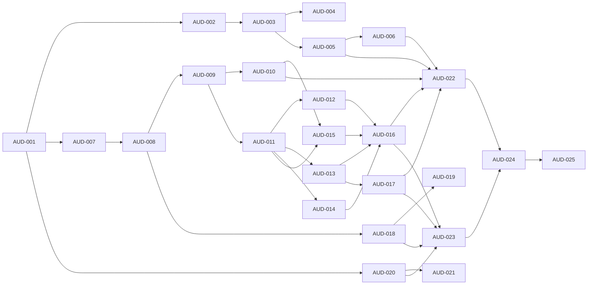

# Backlog de remediación planning-v1.1

Programa `planning-v1 → planning-v1.1`. Esquema de issues `AUD-*` (GitHub #4…#28), hito `planning-v1.1-remediation` (#1). Autoridad de estados: `docs/00-governance/status-model.md` (AUD-002). Plan: `docs/00-governance/remediation-plan-v1.1.md`. Baseline: `docs/00-governance/audit-baseline.md`.

## Issues

| Issue   | GH  | Prioridad | Depende de          | Estado     | Entregable                                                           | Gate   |
| ------- | --- | --------- | ------------------- | ---------- | -------------------------------------------------------------------- | ------ |
| AUD-001 | #4  | P0        | —                   | superseded | Validated by tree/gates                                              | G0     |
| AUD-002 | #5  | P0        | AUD-001             | superseded | Validated by tree/gates                                              | G1     |
| AUD-003 | #6  | P0        | AUD-002             | superseded | Validated by tree/gates                                              | G1     |
| AUD-004 | #7  | P0        | AUD-003             | superseded | Validated by tree/gates                                              | G2     |
| AUD-005 | #8  | P0        | AUD-003             | superseded | Validated by tree/gates                                              | G0–G10 |
| AUD-006 | #9  | P0        | AUD-003, AUD-005    | superseded | Validated by tree/gates                                              | G0–G10 |
| AUD-007 | #10 | P0        | AUD-001             | superseded | Validated by tree/gates                                              | G3     |
| AUD-008 | #11 | P0        | AUD-007             | superseded | Validated by tree/gates                                              | G3     |
| AUD-009 | #12 | P0        | AUD-008             | superseded | Validated by tree/gates                                              | G3/G4  |
| AUD-010 | #13 | P0        | AUD-009             | superseded | Validated by tree/gates                                              | G4     |
| AUD-011 | #14 | P0        | AUD-011             | superseded | Validated by tree/gates                                              | G4     |
| AUD-012 | #15 | P0        | AUD-011             | superseded | Validated by tree/gates                                              | G4     |
| AUD-013 | #16 | P0        | AUD-013             | superseded | Validated by tree/gates                                              | G4     |
| AUD-014 | #17 | P0        | AUD-011             | superseded | Validated by tree/gates                                              | G4/G5  |
| AUD-015 | #18 | P0        | AUD-010, AUD-011    | superseded | Validated by tree/gates                                              | G4     |
| AUD-016 | #19 | P0        | AUD-012…015         | superseded | Validated by tree/gates                                              | G5     |
| AUD-017 | #20 | P0        | AUD-013             | superseded | Validated by tree/gates                                              | G7     |
| AUD-018 | #21 | P0        | AUD-008             | superseded | Validated by tree/gates                                              | G8     |
| AUD-019 | #22 | P0        | AUD-018             | superseded | Validado por árbol/gates                                             | G8     |
| AUD-020 | #23 | P1        | AUD-001             | superseded | Validado por árbol/gates                                             | G6     |
| AUD-021 | #24 | P1        | AUD-020             | superseded | Validado por árbol/gates                                             | G6     |
| AUD-022 | #25 | P0        | AUD-005/006/010…017 | superseded | Ejecución verde + evidencia                                          | G9     |
| AUD-023 | #26 | P0        | AUD-016/017/018/020 | superseded | Alcance incluido/excluido + criterios                                | G10    |
| AUD-024 | #27 | P0        | AUD-022, AUD-023    | in-review  | Revisión independiente (AUD-024 bis); recálculo G0–G10               | G10    |
| AUD-025 | #28 | P0        | AUD-024             | pending    | Baseline `planning-v1.1` con veredicto (publicación por orquestador) | G10    |

## Grafo de dependencias

## Migración a issues MVP-0.1

Los issues AUD-001..AUD-023 están **supersedidos** por la evidencia del walking skeleton y el árbol de gates verificado. Los issues restantes de relevancia para MVP-0.1 son:

| Issue      | Título                                                               | Dueño        | Dependencia | Gate | Criterio Done                                       |
| ---------- | -------------------------------------------------------------------- | ------------ | ----------- | ---- | --------------------------------------------------- |
| MVP-0.1-01 | Validar walking skeleton desde checkout limpio (Rust/WASM/web/Tauri) | Architecture | —           | E2   | Dos ejecuciones limpias con digests idénticos       |
| MVP-0.1-02 | Reconciliar gobernanza: README/plan/gates/tags                       | Delivery     | E1          | E1   | Cero contradicciones P0/P1                          |
| MVP-0.1-03 | Trazabilidad FR/NFR → TST/VAL 100% para slice                        | Data         | E3          | E3   | Cobertura completa + cero huérfanos                 |
| MVP-0.1-04 | Paridad Tauri/WASM byte-a-byte en golden outputs                     | Architecture | E4          | E4   | Mismos bytes/digest/diagnósticos                    |
| MVP-0.1-05 | E2E offline determinista con golden outputs                          | Quality      | E4          | E4   | Flujo completo mism o Core, golden output           |
| MVP-0.1-06 | WCAG 2.2 AA evidencia auto+manual (G6-C01/C03)                       | UX           | E5          | E5   | Auto + manual sin defectos críticos                 |
| MVP-0.1-07 | `trusted_root.json` no placeholder + SBOM/provenance/firma           | Security     | E6          | E6   | Raíz materializada + artefactos verificables        |
| MVP-0.1-08 | Baseline `implementation-baseline-mvp0.1` tag + release verificada   | Release      | E7          | E7   | Tag anotado al commit revisado + release verificada |

## Grafo de dependencias

## Reglas

- Cada issue P0 tiene owner, fecha objetivo y criterio de cierre (ver `status-model.md`).
- Ningún gate `complete` depende de un ítem incompleto (validado por AUD-006).
- Toda excepción declara riesgo residual y autoridad aceptante (AUD-018).
