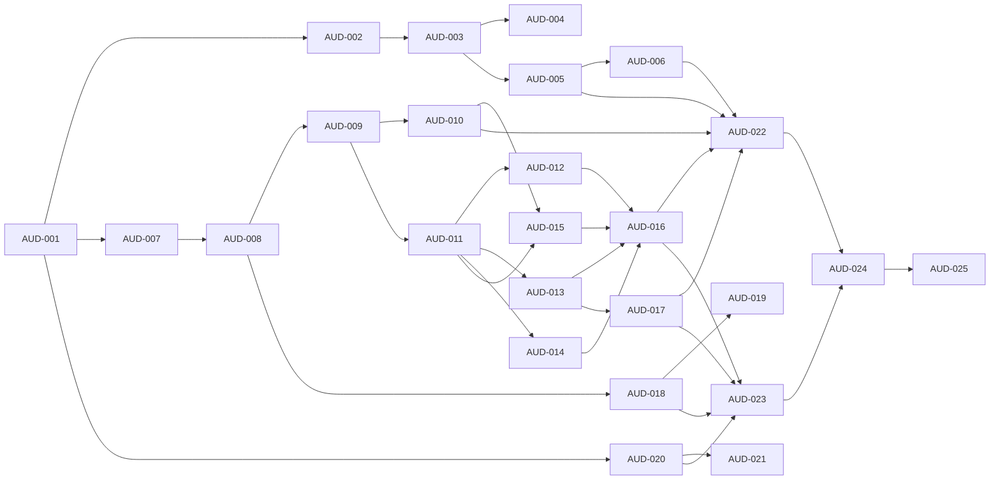

# Backlog de remediación planning-v1.1

Programa `planning-v1 → planning-v1.1`. Esquema de issues `AUD-*` (GitHub #4…#28), hito `planning-v1.1-remediation` (#1). Autoridad de estados: `docs/00-governance/status-model.md` (AUD-002). Plan: `docs/00-governance/remediation-plan-v1.1.md`. Baseline: `docs/00-governance/audit-baseline.md`.

## Issues

| Issue | GH | Prioridad | Depende de | Estado | Entregable | Gate |
|---|---|---:|---|---|---|---|
| AUD-001 | #4 | P0 | — | complete | Etiqueta `planning-v1-audit-baseline`, rama `remediation/planning-v1.1`, hito #1, `audit-baseline.md` | G0 |
| AUD-002 | #5 | P0 | AUD-001 | complete | `status-model.md` + JSON Schema de metadatos | G1 |
| AUD-003 | #6 | P0 | AUD-002 | complete | Front matter YAML en documentos gobernados + validador de transiciones | G1 |
| AUD-004 | #7 | P0 | AUD-003 | complete | `decision-register.md` como autoridad única; DEC-005/006 claras; DEC-009/010 | G2 |
| AUD-005 | #8 | P0 | AUD-003 | complete | Validador de referencias resueltas y coherencia de estados | G0–G10 |
| AUD-006 | #9 | P0 | AUD-003, AUD-005 | complete | `contracts/governance/gate.schema.json` + manifiesto por gate + tabla derivada | G0–G10 |
| AUD-007 | #10 | P0 | AUD-001 | complete | Rust Core como componente interno, no contenedor; límites y protocolos | G3 |
| AUD-008 | #11 | P0 | AUD-007 | complete | `stakeholders-concerns.md` + `viewpoints.md` (ISO 42010) | G3 |
| AUD-009 | #12 | P0 | AUD-008 | complete | ADR-0007 `accepted` con las 12 decisiones normativas | G3/G4 |
| AUD-010 | #13 | P0 | AUD-009 | complete | `contracts/test-vectors/canonicalization/` + verificador independiente en CI | G4 |
| AUD-011 | #14 | P0 | AUD-009 | complete | `common.schema.json` + extracción de `$defs` compartidos | G4 |
| AUD-012 | #15 | P0 | AUD-011 | complete | `draft.schema.json` v0 (`revision`, `contentDigest`, exclusividad `oneOf`) | G4 |
| AUD-013 | #16 | P0 | AUD-011 | complete | `catalog.schema.json` v0 | G4 |
| AUD-014 | #17 | P0 | AUD-011 | complete | `diagnostic.schema.json` v0 + `core-error.schema.json` | G4/G5 |
| AUD-015 | #18 | P0 | AUD-010, AUD-011 | complete | `manifest.schema.json` v0 + `changeset.schema.json` | G4 |
| AUD-016 | #19 | P0 | AUD-012…015 | complete | `core-port.md` v0 + catálogo DTO/errores | G5 |
| AUD-017 | #20 | P0 | AUD-013 | complete | `rule.schema.json`: operadores definidos, corpus por operador | G7 |
| AUD-018 | #21 | P0 | AUD-008 | complete | Modelo inherente/residual con owner y fecha de aceptación | G8 |
| AUD-019 | #22 | P0 | AUD-018 | complete | Firma, custodia de claves, canales, anti-rollback, fail-open offline | G8 |
| AUD-020 | #23 | P1 | AUD-001 | complete | Inventario de tokens heredados y mapa a tokens semánticos | G6 |
| AUD-021 | #24 | P1 | AUD-020 | complete | Matriz WCAG 2.2 AA con evidencia automatizada + manual separada | G6 |
| AUD-022 | #25 | P0 | AUD-005/006/010…017 | complete | Ejecución verde en commit protegido + evidencia | G9 |
| AUD-023 | #26 | P0 | AUD-016/017/018/020 | complete | Alcance incluido/excluido + criterios de aceptación (walking skeleton) | G10 |
| AUD-024 | #27 | P0 | AUD-022, AUD-023 | pending | Revisión de arquitectura, seguridad, a11y, trazabilidad; recálculo G0–G10 | G10 |
| AUD-025 | #28 | P0 | AUD-024 | pending | Baseline `planning-v1.1` con veredicto | G10 |

## Grafo de dependencias

## Reglas

- Cada issue P0 tiene owner, fecha objetivo y criterio de cierre (ver `status-model.md`).
- Ningún gate `complete` depende de un ítem incompleto (validado por AUD-006).
- Toda excepción declara riesgo residual y autoridad aceptante (AUD-018).
