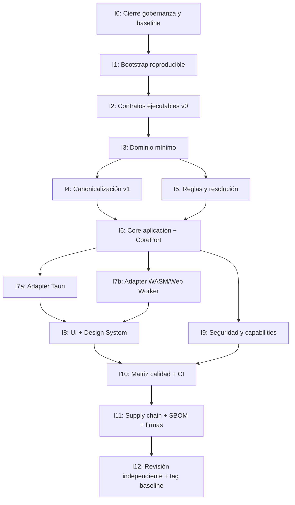

# Plan de implementación MVP-0 — ArchMaker Walking Skeleton

- Documento: DOC-DEL-MVP0-IMP-001 · Estado: draft · Propietario: Delivery · Fecha: 2026-10-06
- Autoridad de estados: `docs/00-governance/status-model.md`.
- Veredicto vigente: **CONDITIONAL-GO — walking skeleton MVP-0 únicamente** (`docs/00-governance/final-review-planning-v1.1.md`).
- Alcance: autoriza exclusivamente el vertical slice de `docs/10-delivery/walking-skeleton.md`; el MVP completo, runner, privilegios y Enterprise quedan bloqueados.

## 1. Resumen ejecutivo

Este plan descompone la implementación del walking skeleton MVP-0 en **13 fases (I0–I12)** con ruta crítica explícita, mapeo a requisitos/ADRs/contratos/riesgos/tests/gates, dependencias, propietarios y criterios de evidencia. El primer entregable firme es el **tag anotado firmado `implementation-baseline-mvp0`** con reconciliación de gobernanza, CI en verde y contratos/ADRs congelados.

## 2. Restricciones inmutables (de gobernanza)

| Restricción                              | Fuente                                     | Consecuencia para la implementación                                          |
| ---------------------------------------- | ------------------------------------------ | ---------------------------------------------------------------------------- |
| Rust es única autoridad semántica        | ADR-0001, DEC-001                          | Zero lógica de dominio en TypeScript; TS solo adapta y presenta              |
| Deny-by-default Tauri                    | ADR-0002, `tauri-policy.md`                | Capabilities mínimas por ventana; sin `shell:*`; CSP `self`                  |
| Sin root, discos, shell, sidecars en MVP | DEC-003, DEC-004, walking-skeleton.md      | Runner v1 diferido; operaciones tipadas únicamente                           |
| Catálogo embebido únicamente             | Walking skeleton, DEC-009                  | Sin descarga remota; fixture en repo                                         |
| Sin ejecución v5.1                       | CON-005, CON-006, CON-012                  | `cmd`/`hooks`/`pacstrap` solo como evidencia no ejecutable                   |
| Perfil canonicalización v1 inmutable     | ADR-0007, `canonicalization-profile-v1.md` | RFC 8785 (JCS) normativo; corpus golden 34 vectores                          |
| CorePort v0 congelado (7 operaciones)    | `core-port.md`                             | `importDraft`/`applyPreset`/etc. fuera de v0                                 |
| Paridad nativo/WASM por golden vectors   | NFR-DET-001, NFR-PORT-001                  | Mismos bytes y digests en ambas implementaciones                             |
| Errores públicos tipados (`CoreError`)   | `core-port.md`, `errors-events.md`         | Códigos `AM-*` desde catálogo único; nada de strings libres                  |
| Licencia Apache-2.0 única                | DEC-005                                    | `LICENSE` ya correcto; sin dual licensing                                    |
| Solo Arch x86_64                         | DEC-008                                    | Matriz de soporte y CI limitada a x86_64                                     |
| Sin telemetría en MVP                    | DEC-010                                    | Solo errores/eventos locales redactados                                      |
| Updater Tauri en MVP (desviación)        | DEC-007                                    | `THR-UPD-001` debe cerrarse antes de MVP-0; canal firmado; fail-open offline |

## 3. Fases y ruta crítica

**Ruta crítica**: `I0 → I1 → I2 → I3 → (I4 ∥ I5) → I6 → (I7a ∥ I7b) → (I8 ∥ I9) → I10 → I11 → I12`

**Paralelismo permitido**: I4/I5, I7a/I7b, I8/I9. No otro paralelismo sin aprobación expresa.

## 4. Detalle por fase

### I0 — Cierre de gobernanza y baseline (P0)

| Aspecto        | Detalle                                                                                                 |
| -------------- | ------------------------------------------------------------------------------------------------------- |
| Objetivo       | Publicar `planning-v1.1` baseline: tag anotado, merge PR #29, CI verde en commit publicado              |
| Entradas       | `docs/00-governance/final-review-planning-v1.1.md`, PR #29, validadores locales                         |
| Salidas        | Tag `planning-v1.1` en `main`; `go-no-go.md` actualizado a CONDITIONAL-GO; CI verde en commit publicado |
| Gates          | G0 `complete`, G3 `in-progress` (doc/diseño `complete`), G10 `in-progress`                              |
| ADR/Decisiones | DEC-001..DEC-010 `accepted`; ADR-0001..0009 `accepted`/`approved`                                       |
| Riesgos        | RSK-007 (supply chain) — política definida, pipeline no                                                 |
| Propietario    | Delivery / Independent Reviewer                                                                         |
| Evidencia      | Tag firmado; `gh run list` verde; `tools/gates.py` coherente                                            |
| Criterio Done  | Tag `planning-v1.1` existe en `origin/main`; CI 100% verde en ese commit                                |

### I1 — Bootstrap reproducible (P0)

| Aspecto        | Detalle                                                                                                                      |
| -------------- | ---------------------------------------------------------------------------------------------------------------------------- |
| Objetivo       | Workspace Rust + Node.js LTS + pnpm + Tauri 2 configurado; toolchain pinned; CI base                                         |
| Entradas       | Ubuntu 26.04; Rust stable pinned; Node LTS; pnpm; Tauri 2                                                                    |
| Salidas        | `Cargo.toml` (workspace), `package.json`, `pnpm-workspace.yaml`, `rust-toolchain.toml`, CI base (`.github/workflows/ci.yml`) |
| Gates          | G9 `in-progress` (doc/impl `in-progress`)                                                                                    |
| ADR/Decisiones | ADR-0001, ADR-0005, ADR-0006                                                                                                 |
| Riesgos        | RSK-007 (lockfiles, audits)                                                                                                  |
| Propietario    | Architecture / Release                                                                                                       |
| Evidencia      | `cargo check --workspace` OK; `pnpm install` OK; CI `ci.yml` pasa en `main`                                                  |
| Criterio Done  | Workspace compila; CI base (lint, format, check) verde en `main`                                                             |

### I2 — Contratos ejecutables v0 (P0)

| Aspecto        | Detalle                                                                                                                                                                                                                                                                                             |
| -------------- | --------------------------------------------------------------------------------------------------------------------------------------------------------------------------------------------------------------------------------------------------------------------------------------------------- |
| Objetivo       | JSON Schema 2020-12 v0 completos (`draft`, `catalog`, `rule`, `diagnostic`, `manifest`, `artifact`, `installation-plan`, `runner-envelope`, `common`, `core-error`, `changeset`) con `additionalProperties: false`; corpus válido/inválido + fixture migración v5.1→vNext; meta-validación CI verde |
| Entradas       | `contracts/json-schema/` (ya existentes), `reference/v5.1/archmaker.instance.v5.1.json`                                                                                                                                                                                                             |
| Salidas        | Schemas v0 `accepted`; `examples/*.valid.json` + `*.invalid.json` (mínimo 1 por contrato); `migration/v5.1-instance.sample.json` + `vnext-draft.expected.json`; CI `json-schema.yml` verde                                                                                                          |
| Gates          | G4 `in-progress` → `complete` (doc/diseño/artefacto); G5 `in-progress` (doc `complete`)                                                                                                                                                                                                             |
| ADR/Decisiones | ADR-0005, ADR-0006, ADR-0007, DEC-002                                                                                                                                                                                                                                                               |
| Contratos      | Todos los schemas v0 en `contracts/json-schema/`                                                                                                                                                                                                                                                    |
| Riesgos        | RSK-004 (migración pierde selecciones) — corpus golden migración                                                                                                                                                                                                                                    |
| Propietario    | Data / Interfaces                                                                                                                                                                                                                                                                                   |
| Evidencia      | `python3 tools/validate_schema_refs.py` exit 0; meta-validación Draft 2020-12 CI verde; corpus válido/inválido ejecuta y pasa                                                                                                                                                                       |
| Criterio Done  | Todos los schemas v0 `accepted`; CI `json-schema.yml` 100% verde; corpus por contrato con casos válido + inválido                                                                                                                                                                                   |

### I3 — Dominio mínimo (P0)

| Aspecto        | Detalle                                                                                                                                                                                                                                                                                         |
| -------------- | ----------------------------------------------------------------------------------------------------------------------------------------------------------------------------------------------------------------------------------------------------------------------------------------------- |
| Objetivo       | Tipos de dominio Rust (`Catalog`, `Draft`, `SelectionValue`, `Resolution`, `Manifest`, `Artifact`, `InstallationPlan`, `Producer`, `CapabilityRef`, `CatalogRef`, `TargetRef`, `Digest`) derivados de schemas v0; serialización/deserialización con `serde`; validación contra schemas en tests |
| Entradas       | Schemas v0 (I2), `domain-model.md`, `canonicalization-profile-v1.md`                                                                                                                                                                                                                            |
| Salidas        | Crate `archmaker-domain` con tipos + `serde` + validación; tests de round-trip JSON ↔ tipos; `contentDigest` calculado según ADR-0007                                                                                                                                                           |
| Gates          | G4 `in-progress` → `complete` (impl/verif); G7 `in-progress`                                                                                                                                                                                                                                    |
| ADR/Decisiones | ADR-0001, ADR-0003, ADR-0006, ADR-0007, DEC-002, DEC-003                                                                                                                                                                                                                                        |
| Contratos      | `draft.schema.json`, `catalog.schema.json`, `manifest.schema.json`, `common.schema.json`                                                                                                                                                                                                        |
| Riesgos        | RSK-003 (divergencia WASM/Tauri) — tipos solo en Rust; RSK-004 (migración)                                                                                                                                                                                                                      |
| Propietario    | Architecture / Data                                                                                                                                                                                                                                                                             |
| Evidencia      | `cargo test -p archmaker-domain` verde; round-trip con `examples/*.valid.json`; `contentDigest` coincide con vectores golden                                                                                                                                                                    |
| Criterio Done  | Tipos compilan; serialización canónica produce bytes idénticos a `tools/canonicalize.py` para vectores de dominio; tests de validación contra schemas pasan                                                                                                                                     |

### I4 — Canonicalización v1 (P0)

| Aspecto        | Detalle                                                                                                                                                                                                                |
| -------------- | ---------------------------------------------------------------------------------------------------------------------------------------------------------------------------------------------------------------------- |
| Objetivo       | Implementación Rust de RFC 8785 (JCS) + 12 decisiones de perfil v1; paridad byte-a-byte con `tools/canonicalize.py` y corpus golden 34 vectores; `domainTag` y `contentDigest`/`artifactDigest`                        |
| Entradas       | `canonicalization-profile-v1.md`, `ADR-0007`, `contracts/test-vectors/canonicalization/`, `tools/canonicalize.py`                                                                                                      |
| Salidas        | Crate `archmaker-canonicalization` con `canonicalize(&Value) -> Vec<u8>` y `digest(&Value, domainTag) -> Digest`; tests de paridad con Python/JS (34 vectores); integración en `archmaker-domain` para `contentDigest` |
| Gates          | G4 `complete` (verif); G7 `in-progress` (metric-verified)                                                                                                                                                              |
| ADR/Decisiones | ADR-0007 (12 decisiones normativas)                                                                                                                                                                                    |
| Contratos      | `common.schema.json#/$defs/contentDigest`, `manifest.schema.json`                                                                                                                                                      |
| Riesgos        | RSK-003 (paridad nativo/WASM) — golden vectors exigen paridad; RSK-004 (migración)                                                                                                                                     |
| Propietario    | Architecture / Data                                                                                                                                                                                                    |
| Evidencia      | `cargo test -p archmaker-canonicalization` verde; 34 vectores byte-idénticos a Python; WASM compile target pasa                                                                                                        |
| Criterio Done  | Implementación Rust produce bytes y digests idénticos a `tools/canonicalize.py` para todos los 34 vectores; compila para `wasm32-unknown-unknown`                                                                      |

### I5 — Reglas y resolución (P0)

| Aspecto        | Detalle                                                                                                                                                                                                                                                                                                                                    |
| -------------- | ------------------------------------------------------------------------------------------------------------------------------------------------------------------------------------------------------------------------------------------------------------------------------------------------------------------------------------------ |
| Objetivo       | AST de operadores (vocabulario cerrado `rule.schema.json`); evaluador de reglas; 7 reglas implementables (RULE-COMP-001, RULE-DM-001, RULE-KERNEL-001, RULE-BROWSER-001, RULE-PKG-001, RULE-KERNEL-002, RULE-DUP-001); corpus por operador; resolución de selecciones efectivas, capabilities, conflictos; diagnóstico tipado `Diagnostic` |
| Entradas       | `rule-inventory.md`, `operator-spec.md`, `operator-corpus.md`, `pipeline.md`, `errors-events.md`, `core-port.md`                                                                                                                                                                                                                           |
| Salidas        | Crate `archmaker-rules` (AST + evaluador); Crate `archmaker-resolution` (resolución + capabilities + conflictos); corpus `rule-corpus/operators.corpus.json` ejecutable en CI; tests por regla (positivo/negativo)                                                                                                                         |
| Gates          | G7 `in-progress` → `complete` (impl/verif); G5 `in-progress` (impl)                                                                                                                                                                                                                                                                        |
| ADR/Decisiones | ADR-0001, ADR-0005, DEC-002                                                                                                                                                                                                                                                                                                                |
| Contratos      | `rule.schema.json`, `diagnostic.schema.json`, `common.schema.json#/$defs/capabilityRef`, `core-port.md` (`resolveDraft`, `validateDraft`)                                                                                                                                                                                                  |
| Riesgos        | RSK-002 (ejecución arbitraria) — sin shell, operaciones enum; RSK-004 (migración)                                                                                                                                                                                                                                                          |
| Propietario    | Quality / Architecture                                                                                                                                                                                                                                                                                                                     |
| Evidencia      | Corpus por operador en CI verde; 7 reglas con test positivo + negativo; resolución determinista (mismo input → mismo `resolutionDigest`); diagnósticos ordenados `(path, code, source)`                                                                                                                                                    |
| Criterio Done  | Evaluador pasa corpus; resolución produce `ResolveResult` con `effectiveSelections`, `providedCapabilities`, `requiredCapabilities`, `conflicts`, `diagnostics`; golden parity nativo/WASM                                                                                                                                                 |

### I6 — Core aplicación + CorePort v0 (P0)

| Aspecto        | Detalle                                                                                                                                                                                                                                                                                                          |
| -------------- | ---------------------------------------------------------------------------------------------------------------------------------------------------------------------------------------------------------------------------------------------------------------------------------------------------------------- |
| Objetivo       | Implementación de las 7 operaciones `CorePort` en Rust: `createDraft`, `loadCatalog`, `saveDraft`, `resolveDraft`, `validateDraft`, `buildManifest`, `exportArtifact`; errores tipados `CoreError`; pre/postcondiciones según `core-port.md`; escritura atómica (`temp` + `fsync` + `rename`); catálogo embebido |
| Entradas       | `core-port.md`, `dto.md`, `errors-events.md`, `tauri-commands.md`, crates I3–I5                                                                                                                                                                                                                                  |
| Salidas        | Crate `archmaker-core` con `CorePort` trait + implementación; catálogo fixture embebido (`embedded-catalog.json`); tests de contrato por operación (request/response válido/inválido); test de conflicto de revisión `saveDraft`                                                                                 |
| Gates          | G5 `in-progress` → `complete` (impl/verif); G10 `in-progress` (impl)                                                                                                                                                                                                                                             |
| ADR/Decisiones | ADR-0001, ADR-0003, ADR-0004, ADR-0007, DEC-001, DEC-003, DEC-004, DEC-008                                                                                                                                                                                                                                       |
| Contratos      | Todos los schemas v0; `core-port.md` (7 ops, pre/post, errores, límites, I/O profile)                                                                                                                                                                                                                            |
| Riesgos        | RSK-001 (disco equivocado) — escritura atómica + `expectedRevision`; RSK-002 (ejecución arbitraria) — solo ops enum; RSK-003 (paridad) — core puramente Rust                                                                                                                                                     |
| Propietario    | Architecture                                                                                                                                                                                                                                                                                                     |
| Evidencia      | Tests por operación (request/response válido + inválido); test `saveDraft` conflicto revisión; test `loadCatalog` embedded + file (picker handle); test `exportArtifact` byte-idempotencia; CI verde                                                                                                             |
| Criterio Done  | 7 ops implementadas con pre/postcondiciones; errores `CoreError` con códigos `AM-*`; catálogo embebido carga; escritura atómica verificada; CI verde                                                                                                                                                             |

### I7a — Adapter Tauri (P0)

| Aspecto        | Detalle                                                                                                                                                                                                       |
| -------------- | ------------------------------------------------------------------------------------------------------------------------------------------------------------------------------------------------------------- |
| Objetivo       | Adapter Tauri 2 mínimo que expone `CorePort` via commands; deny-by-default capabilities; scopes filesystem mínimos; sin `shell:*`; CSP `self`; devtools desactivadas en release; test negativo por capability |
| Entradas       | `tauri-policy.md`, `tauri-commands.md`, `core-port.md`, `archmaker-core` (I6)                                                                                                                                 |
| Salidas        | `src-tauri/` con `tauri.conf.json` (capabilities, allowlist, CSP); commands Rust ↔ TS (`invoke`); tipos TS generados desde schemas v0; test negativo por capability                                           |
| Gates          | G5 `complete` (verif → G5-C03); G8 `in-progress` (impl); G10 `in-progress`                                                                                                                                    |
| ADR/Decisiones | ADR-0001, ADR-0002, DEC-004, DEC-006, DEC-009                                                                                                                                                                 |
| Contratos      | `tauri-commands.md` (8 commands mapeados a 7 ops + `loadCatalog` embedded); `core-port.md`                                                                                                                    |
| Riesgos        | RSK-001/002/008 — capabilities deny-by-default; THR-IPC-001, THR-FS-001                                                                                                                                       |
| Propietario    | Architecture / Security                                                                                                                                                                                       |
| Evidencia      | `cargo tauri build` compila; test negativo por capability (invoke no permitido → error); CSP `self` verificado; `tauri.conf.json` capabilities mínimas                                                        |
| Criterio Done  | Adapter Tauri expone 7 ops vía invoke; deny-by-default verificado; test negativo por capability pasa; CI verde                                                                                                |

### I7b — Adapter WASM / Web Worker (P0)

| Aspecto        | Detalle                                                                                                                                                                   |
| -------------- | ------------------------------------------------------------------------------------------------------------------------------------------------------------------------- |
| Objetivo       | Adapter WASM que expone la misma interfaz `CorePort` (wasm-bindgen); mismo crate `archmaker-core` compilado a WASM; paridad golden con nativo; Web Worker wrapper para UI |
| Entradas       | `tauri-wasm.md`, `core-port.md`, `archmaker-core` (I6), `archmaker-canonicalization` (I4)                                                                                 |
| Salidas        | Crate `archmaker-wasm` (`wasm-bindgen`); bindings TS; Web Worker TS wrapper; tests de paridad golden (mismos bytes manifest, mismos digests, mismos diagnósticos)         |
| Gates          | G5 `complete` (verif → G5-C03); G10 `in-progress`                                                                                                                         |
| ADR/Decisiones | ADR-0001, ADR-0007, NFR-DET-001, NFR-PORT-001                                                                                                                             |
| Contratos      | `core-port.md`, `tauri-wasm.md`                                                                                                                                           |
| Riesgos        | RSK-003 (divergencia WASM/Tauri) — golden parity obligatoria                                                                                                              |
| Propietario    | Architecture                                                                                                                                                              |
| Evidencia      | `wasm-pack build --target web` OK; test paridad: mismo input → mismos bytes `contentDigest`, mismos diagnósticos, mismo `resolutionDigest`                                |
| Criterio Done  | WASM compila; paridad golden nativo/WASM verificada en CI; misma interfaz `CorePort` expuesta                                                                             |

### I8 — UI + Design System (P0)

| Aspecto        | Detalle                                                                                                                                                                                                                                                                 |
| -------------- | ----------------------------------------------------------------------------------------------------------------------------------------------------------------------------------------------------------------------------------------------------------------------- |
| Objetivo       | UI mínima Tauri + WASM que recorre el flujo: crear draft → seleccionar → resolver → validar → manifest → exportar; design system tokens (Style Dictionary) + Tailwind v4; baseline visual sin regresiones; accesibilidad WCAG 2.2 AA (contraste, focus, reduced-motion) |
| Entradas       | `visual-baseline.md`, `design-system.md`, `token-migration.md`, `accessibility-matrix.md`, `component-contracts.md`, `interaction-matrix.md`, adapters I7a/I7b                                                                                                          |
| Salidas        | App Tauri + Web; componentes `v0` contratados; tokens canónicos; tests visual regression (golden screenshots); evidencia WCAG automatizada + manual                                                                                                                     |
| Gates          | G6 `in-progress` → `complete` (doc/diseño/impl/verif); G10 `in-progress`                                                                                                                                                                                                |
| ADR/Decisiones | ADR-0002, DEC-009, DEC-010                                                                                                                                                                                                                                              |
| Contratos      | `component-contracts.md`, `interaction-matrix.md`, `core-port.md` (DTO TS)                                                                                                                                                                                              |
| Riesgos        | RSK-006 (CDN offline/CSP) — bundling + CSP `self`; RSK-009 (design system degrada) — visual regression                                                                                                                                                                  |
| Propietario    | UX / Design                                                                                                                                                                                                                                                             |
| Evidencia      | Visual regression 0 diff vs baseline; WCAG 2.2 AA: contraste, focus visible, reduced-motion, ARIA — evidencia automatizada (axe) + manual; tokens `--rh-*` preservados como alias                                                                                       |
| Criterio Done  | Flujo E2E verificable offline; 0 regresiones visuales; WCAG 2.2 AA evidencia ejecutada; CI verde                                                                                                                                                                        |

### I9 — Seguridad y capabilities (P0)

| Aspecto        | Detalle                                                                                                                                                                                                                                    |
| -------------- | ------------------------------------------------------------------------------------------------------------------------------------------------------------------------------------------------------------------------------------------ |
| Objetivo       | Threat model aprobado; privilege model; capabilities por ventana; tests negativos de capabilities/elevación; cierre RSK-001/002/008 con evidencia implementación; `THR-UPD-001` modelado (canal firmado, anti-rollback, fail-open offline) |
| Entradas       | `threat-model.md`, `privilege-model.md`, `residual-risk-model.md`, `updater-threat-model.md`, `tauri-policy.md`, `runner-hazard-analysis.md`, `mvp-negative-tests.md`, adapters I7a/I7b                                                    |
| Salidas        | Threat model `accepted`; capabilities Tauri por ventana (main, dialog, picker); tests negativos: invoke no permitido, fs fuera de scope, shell bloqueado; evidencia cierre RSK-001/002/008                                                 |
| Gates          | G8 `in-progress` → `complete` (doc/diseño/impl/verif); G10 `in-progress`                                                                                                                                                                   |
| ADR/Decisiones | ADR-0002, ADR-0004, ADR-0008, ADR-0009, DEC-004, DEC-006, DEC-007                                                                                                                                                                          |
| Contratos      | `core-port.md` (redacción), `tauri-commands.md`, `tauri-policy.md`                                                                                                                                                                         |
| Riesgos        | RSK-001 (disco equivocado), RSK-002 (ejecución arbitraria), RSK-008 (elevación insegura), THR-UPD-001                                                                                                                                      |
| Propietario    | Security                                                                                                                                                                                                                                   |
| Evidencia      | Tests negativosCapabilities ejecutan y fallan como esperado; `cargo test -p archmaker-core` incluye negative tests; threat model firmado por Security                                                                                      |
| Criterio Done  | Threat model `accepted`; tests negativos capabilities/elevación en CI verde; RSK-001/002/008 con evidencia implementación; `THR-UPD-001` modelado con canal firmado                                                                        |

### I10 — Matriz calidad + CI (P0)

| Aspecto        | Detalle                                                                                                                                                                                                                       |
| -------------- | ----------------------------------------------------------------------------------------------------------------------------------------------------------------------------------------------------------------------------- |
| Objetivo       | CI completa: lint (Rust + TS), format, check, test (unit, integración, contract, corpus, golden parity), visual regression, accesibilidad, security audit (cargo audit, npm audit), dependency check; test matrix documentada |
| Entradas       | `ci-cd.md`, `test-matrix.md`, `documentation-validation.md`, todos los crates I1–I9                                                                                                                                           |
| Salidas        | `.github/workflows/ci.yml` completa; `test-matrix.md` actualizada con cobertura real; `cargo audit` / `npm audit` sin hallazgos P0; Renovate configurado                                                                      |
| Gates          | G9 `in-progress` → `complete` (impl/verif); G10 `in-progress`                                                                                                                                                                 |
| ADR/Decisiones | ADR-0005, ADR-0006, ADR-0008, DEC-006                                                                                                                                                                                         |
| Contratos      | Todos los schemas v0; `core-port.md` test vectors                                                                                                                                                                             |
| Riesgos        | RSK-007 (supply chain) — lockfiles, audits, SBOM                                                                                                                                                                              |
| Propietario    | Quality / Release                                                                                                                                                                                                             |
| Evidencia      | CI `ci.yml` 100% verde en `main`; `cargo audit` / `npm audit` 0 P0; test matrix cobertura ≥ 80% core; visual regression + WCAG en CI                                                                                          |
| Criterio Done  | CI completa verde; test matrix documentada; auditorías limpias; Renovate activo                                                                                                                                               |

### I11 — Supply chain + SBOM + firmas (P0)

| Aspecto        | Detalle                                                                                                                                                                                                     |
| -------------- | ----------------------------------------------------------------------------------------------------------------------------------------------------------------------------------------------------------- |
| Objetivo       | SBOM (CycloneDX) generado en CI; firmas Sigstore keyless (Fulcio/Rekor) de release binarios + SBOM; verificación offline con `trusted_root.json` embebido; provenance (SLSA nível 1); canal updater firmado |
| Entradas       | `packaging-release.md`, `supply-chain-policy.md`, `ADR-0008`, `ADR-0009`, `DEC-006`, `DEC-007`, CI I10                                                                                                      |
| Salidas        | Job CI `release.yml`: build → SBOM → sign → verify offline → provenance → upload artifacts; `trusted_root.json` en repo; política canal/versión mínima/rollback documentada                                 |
| Gates          | G9 `complete` (G9-C03); G10 `in-progress`                                                                                                                                                                   |
| ADR/Decisiones | ADR-0008, ADR-0009, DEC-006, DEC-007                                                                                                                                                                        |
| Contratos      | `artifact.schema.json`, `common.schema.json#/$defs/contentDigest`                                                                                                                                           |
| Riesgos        | RSK-007 (supply chain) — cerrar con evidencia ejecutable                                                                                                                                                    |
| Propietario    | Release / Security                                                                                                                                                                                          |
| Evidencia      | `cosign verify` con `trusted_root.json` embebido pasa; SBOM CycloneDX válido; provenance SLSA 1; canal firmado verificado                                                                                   |
| Criterio Done  | Release pipeline genera artefactos firmados, SBOM, provenance; verificación offline pasa; CI `release.yml` verde                                                                                            |

### I12 — Revisión independiente + Tag baseline (P0)

| Aspecto        | Detalle                                                                                                                                                                                  |
| -------------- | ---------------------------------------------------------------------------------------------------------------------------------------------------------------------------------------- |
| Objetivo       | Revisión independiente final (AUD-024 bis) del walking skeleton implementado; recálculo gates G0–G10; publicación tag anotado firmado `implementation-baseline-mvp0`; evidencia completa |
| Entradas       | Todas las fases I0–I11 completas; `docs/00-governance/final-review-planning-v1.1.md` (R13)                                                                                               |
| Salidas        | Tag `implementation-baseline-mvp0` firmado; `go-no-go.md` actualizado (walking skeleton verificado); gates G0–G10 recalculados; `plan-status.md` actualizado                             |
| Gates          | G0–G10 → `complete` (walking skeleton); G10 `complete` (release)                                                                                                                         |
| ADR/Decisiones | Todas DEC-001..DEC-010, ADR-0001..0009                                                                                                                                                   |
| Riesgos        | RSK-001/002/003/004/007/008 — todos con evidencia                                                                                                                                        |
| Propietario    | Independent Reviewer / Delivery                                                                                                                                                          |
| Evidencia      | Tag firmado existe; CI verde en commit tag; gates recalculados `complete` para slice; evidencia por fase archivada                                                                       |
| Criterio Done  | Tag `implementation-baseline-mvp0` en `origin/main`; CI verde; gates G0–G10 `complete` para walking skeleton; condiciones C1–C8 cerradas o con plan de cierre fechado                    |

## 5. Mapeo tarea → trazabilidad

Cada tarea referencia: Requisitos (FR/NFR), ADRs, Contratos (schemas), Riesgos (RSK), Amenazas (THR), Tests (TST), Gates (G), Dependencias, Propietario, Evidencia.

| Fase | Tarea ID | Descripción                                                        | Requisitos                                                                                | ADRs                                   | Contratos                              | Riesgos                                | Tests                                                                          | Gates   | Deps            | Owner                 | Evidencia                    |
| ---- | -------- | ------------------------------------------------------------------ | ----------------------------------------------------------------------------------------- | -------------------------------------- | -------------------------------------- | -------------------------------------- | ------------------------------------------------------------------------------ | ------- | --------------- | --------------------- | ---------------------------- |
| I0   | T-I0-01  | Merge PR #29, tag `planning-v1.1`                                  | —                                                                                         | —                                      | —                                      | —                                      | —                                                                              | G0, G10 | —               | Delivery              | Tag firmado; CI verde        |
| I0   | T-I0-02  | Actualizar `go-no-go.md` a CONDITIONAL-GO                          | —                                                                                         | —                                      | —                                      | —                                      | —                                                                              | G0, G10 | T-I0-01         | Delivery              | Documento actualizado        |
| I1   | T-I1-01  | Crear workspace Rust (`Cargo.toml`)                                | NFR-PORT-001                                                                              | ADR-0001                               | —                                      | RSK-007                                | —                                                                              | G9      | —               | Architecture          | `cargo check --workspace`    |
| I1   | T-I1-02  | Configurar Node LTS + pnpm + Tauri 2                               | NFR-PORT-001                                                                              | ADR-0001                               | —                                      | RSK-007                                | —                                                                              | G9      | T-I1-01         | Architecture          | `pnpm install` OK            |
| I1   | T-I1-03  | CI base (lint, format, check)                                      | NFR-OBS-001                                                                               | ADR-0005                               | —                                      | RSK-007                                | —                                                                              | G9      | T-I1-01         | Release               | CI `ci.yml` verde            |
| I2   | T-I2-01  | Finalizar schemas v0 + corpus válido/inválido                      | FR-DRAFT-001, FR-CAT-001, FR-MANIFEST-001                                                 | ADR-0005, ADR-0006                     | Todos v0                               | RSK-004                                | TST-MIG-001                                                                    | G4, G5  | —               | Data/Interfaces       | Meta-validación CI verde     |
| I2   | T-I2-02  | Fixture migración v5.1→vNext                                       | NFR-MIG-001                                                                               | ADR-0007                               | migration/*                            | RSK-004                                | TST-MIG-001                                                                    | G4      | T-I2-01         | Data                  | Corpus migración pasa        |
| I3   | T-I3-01  | Crate `archmaker-domain` tipos + serde                             | FR-DRAFT-001, FR-CAT-001                                                                  | ADR-0001, ADR-0003                     | draft, catalog, common                 | RSK-003, RSK-004                       | TST-DRAFT-001                                                                  | G4, G7  | I2              | Architecture/Data     | Round-trip JSON ↔ tipos      |
| I3   | T-I3-02  | `contentDigest` en domain (ADR-0007)                               | NFR-DET-001                                                                               | ADR-0007                               | common#contentDigest                   | RSK-003, RSK-004                       | TST-DET-001                                                                    | G4, G7  | I4              | Data                  | Coincide vectores golden     |
| I4   | T-I4-01  | Crate `archmaker-canonicalization` (JCS + 12 decisiones)           | NFR-DET-001                                                                               | ADR-0007                               | common#contentDigest                   | RSK-003, RSK-004                       | TST-DET-001, TST-PORT-001                                                      | G4, G7  | I3              | Architecture/Data     | 34 vectores byte-idénticos   |
| I4   | T-I4-02  | Paridad nativo/WASM canonicalización                               | NFR-PORT-001                                                                              | ADR-0007                               | —                                      | RSK-003                                | TST-PORT-001                                                                   | G5-C03  | I4, I7b         | Architecture          | WASM compile + parity        |
| I5   | T-I5-01  | Crate `archmaker-rules` (AST + evaluador)                          | FR-RESOLVE-001, FR-VALIDATE-001                                                           | ADR-0001, ADR-0005                     | rule, diagnostic                       | RSK-002                                | TST-RES-001, TST-VAL-001                                                       | G7      | I3              | Quality/Architecture  | Corpus operadores CI verde   |
| I5   | T-I5-02  | Crate `archmaker-resolution` (resolución + capabilities)           | FR-RESOLVE-001                                                                            | ADR-0001                               | common#capabilityRef                   | RSK-002, RSK-004                       | TST-RES-001                                                                    | G7, G5  | I3, I5-01       | Architecture          | Determinista + golden parity |
| I5   | T-I5-03  | 7 reglas implementables + corpus                                   | FR-CAT-001, FR-VALIDATE-001                                                               | ADR-0001                               | rule, diagnostic                       | RSK-002                                | TST-RULE-*                                                                     | G7      | I5-01           | Quality               | 7 reglas × pos/neg tests     |
| I6   | T-I6-01  | Crate `archmaker-core` (7 ops CorePort)                            | FR-DRAFT-001, FR-CAT-001, FR-RESOLVE-001, FR-VALIDATE-001, FR-MANIFEST-001, FR-EXPORT-001 | ADR-0001, ADR-0003, ADR-0004, ADR-0007 | Todos v0 + core-port.md                | RSK-001, RSK-002, RSK-003              | TST-DRAFT-001, TST-CAT-001, TST-RES-001, TST-VAL-001, TST-MAN-001, TST-EXP-001 | G5, G10 | I3, I4, I5      | Architecture          | 7 ops + tests contrato       |
| I6   | T-I6-02  | Catálogo fixture embebido                                          | FR-CAT-001                                                                                | ADR-0003                               | catalog.schema.json                    | RSK-005                                | TST-CAT-001                                                                    | G5      | I6-01           | Architecture          | Embedded carga sin red       |
| I6   | T-I6-03  | Escritura atómica `saveDraft` + conflicto revisión                 | NFR-DET-001, NFR-OFF-001                                                                  | ADR-0007                               | draft#saveDraftRequest                 | RSK-001                                | TST-NEG-001                                                                    | G5, G8  | I6-01           | Architecture          | Test conflicto pasa          |
| I7a  | T-I7a-01 | Adapter Tauri commands + capabilities                              | NFR-SEC-001, NFR-PORT-001                                                                 | ADR-0001, ADR-0002                     | tauri-commands.md                      | RSK-001, RSK-002, RSK-008              | TST-SEC-001                                                                    | G5, G8  | I6              | Architecture/Security | Deny-by-default verificado   |
| I7a  | T-I7a-02 | Types TS generados + invoke Tauri                                  | NFR-PORT-001                                                                              | ADR-0001, ADR-0005                     | core-port.md (DTO)                     | RSK-003                                | TST-PORT-001                                                                   | G5      | I6, I7a-01      | Architecture          | TS types match Rust          |
| I7a  | T-I7a-03 | Tests negativos capabilities Tauri (1 por capability)              | NFR-SEC-001                                                                               | ADR-0002                               | tauri-commands.md, tauri-policy.md     | RSK-001, RSK-002, RSK-008              | TST-SEC-001, TST-NEG-001                                                       | G8      | I7a-01          | Security              | Test negativo por capability |
| I7b  | T-I7b-01 | Crate `archmaker-wasm` + wasm-bindgen                              | NFR-PORT-001, NFR-DET-001                                                                 | ADR-0001, ADR-0007                     | core-port.md, tauri-wasm.md            | RSK-003                                | TST-PORT-001                                                                   | G5      | I6, I4          | Architecture          | WASM build + parity          |
| I7b  | T-I7b-02 | Web Worker wrapper + bindings TS                                   | NFR-PORT-001                                                                              | ADR-0001                               | core-port.md, tauri-wasm.md            | RSK-003                                | TST-PORT-001                                                                   | G5      | I7b-01          | Architecture          | WASM + frontend              |
| I7b  | T-I7b-03 | Tests paridad golden nativo/WASM (manifest, digests, diagnósticos) | NFR-DET-001, NFR-PORT-001                                                                 | ADR-0001, ADR-0007                     | core-port.md, tauri-wasm.md            | RSK-003                                | TST-PORT-001                                                                   | G5-C03  | I7b-01, I4      | Architecture          | Mismos digests/diagnósticos  |
| I8   | T-I8-01  | Design system tokens + Tailwind v4                                 | NFR-OFF-001                                                                               | ADR-0002                               | design-system.md                       | RSK-006, RSK-009                       | TST-VIS-001                                                                    | G6      | I7a, I7b        | UX/Design             | Tokens canónicos; 0 diff     |
| I8   | T-I8-02  | Componentes v0 + flujo E2E offline                                 | FR-DRAFT-001, FR-EXPORT-001                                                               | ADR-0001                               | component-contracts.md                 | RSK-009                                | TST-E2E-001                                                                    | G6, G10 | I8-01, I7a, I7b | UX                    | Flujo E2E offline            |
| I8   | T-I8-03  | Visual regression (golden screenshots)                             | NFR-OBS-001                                                                               | ADR-0002                               | visual-baseline.md                     | RSK-009                                | TST-VIS-001                                                                    | G6      | I8-01           | UX/Design             | 0 diff vs baseline           |
| I8   | T-I8-04  | Accesibilidad WCAG 2.2 AA (axe + manual)                           | NFR-OBS-001                                                                               | ADR-0002                               | accessibility-matrix.md                | RSK-009                                | TST-A11Y-001                                                                   | G6      | I8-01           | UX                    | axe + manual evidence        |
| I9   | T-I9-01  | Threat model + privilege model `accepted`                          | NFR-SEC-001                                                                               | ADR-0002, ADR-0004                     | threat-model.md, privilege-model.md    | RSK-001, RSK-002, RSK-008              | —                                                                              | G8      | —               | Security              | Documentos `accepted`        |
| I9   | T-I9-02  | Capabilities Tauri por ventana (main, dialog, picker)              | NFR-SEC-001                                                                               | ADR-0002, ADR-0004                     | tauri-commands.md, tauri-policy.md     | RSK-001, RSK-002, RSK-008              | TST-SEC-001, TST-NEG-001                                                       | G8      | I7a             | Security              | Test negativo por capability |
| I9   | T-I9-03  | Tests negativos capabilities/elevación                             | NFR-SEC-001                                                                               | ADR-0004                               | tauri-policy.md, mvp-negative-tests.md | RSK-001, RSK-002, RSK-008              | TST-NEG-001                                                                    | G8      | I9-02           | Security              | Tests negativos pasan        |
| I9   | T-I9-04  | Cierre RSK-001/002/008 con evidencia implementación                | NFR-SEC-001                                                                               | ADR-0004, ADR-0009                     | updater-threat-model.md                | RSK-001, RSK-002, RSK-008, THR-UPD-001 | TST-NEG-001                                                                    | G8      | I9-01, I9-02    | Security              | Evidencia implementación     |
| I9   | T-I9-05  | Modelado THR-UPD-001 (canal firmado, anti-rollback, fail-open)     | NFR-SEC-001                                                                               | ADR-0009                               | —                                      | RSK-007, THR-UPD-001                   | —                                                                              | G9, G8  | T-I9-01         | Security              | threat-model, updater        |
| I10  | T-I10-01 | CI completa (lint, test, audit, visual, a11y, security)            | NFR-OBS-001                                                                               | ADR-0005, ADR-0006                     | —                                      | RSK-007, RSK-009                       | TST-ALL                                                                        | G9      | I1–I9           | Quality/Release       | CI 100% verde                |
| I10  | T-I10-02 | Test matrix documentada + Renovate                                 | NFR-OBS-001                                                                               | ADR-0006                               | test-matrix.md                         | RSK-007                                | —                                                                              | G9      | T-I10-01        | Quality               | Matriz ≥ 80% core            |
| I11  | T-I11-01 | SBOM CycloneDX + firmas Sigstore keyless                           | NFR-SEC-001, NFR-OBS-001                                                                  | ADR-0008, ADR-0009                     | artifact, common                       | RSK-007                                | TST-REL-001                                                                    | G9      | I10             | Release/Security      | `cosign verify` offline OK   |
| I11  | T-I11-02 | Verificación offline `cosign` + `trusted_root.json`                | NFR-SEC-001                                                                               | ADR-0009                               | artifact, common                       | RSK-007                                | —                                                                              | G9      | T-I11-01        | Release/Security      | supply-chain, verification   |
| I11  | T-I11-03 | Provenance SLSA 1 + canal updater firmado                          | NFR-SEC-001                                                                               | ADR-0009                               | —                                      | RSK-007, THR-UPD-001                   | —                                                                              | G9, G8  | T-I11-01        | Release/Security      | Provenance + canal firmado   |
| I12  | T-I12-01 | Revisión independiente final (AUD-024 bis)                         | —                                                                                         | —                                      | —                                      | —                                      | —                                                                              | G0–G10  | I0–I11          | Independent Reviewer  | Informe recálculo gates      |
| I12  | T-I12-02 | Tag `implementation-baseline-mvp0` firmado + CI verde              | —                                                                                         | —                                      | —                                      | —                                      | —                                                                              | G10     | T-I12-01        | Delivery              | Tag en origin/main; CI verde |

## 6. Hitos de GitHub propuestos

| Hito                              | Fases    | Issues  | Fecha objetivo | Criterio de cierre                                  |
| --------------------------------- | -------- | ------- | -------------- | --------------------------------------------------- |
| **M0: Governance Baseline**       | I0       | #1–#2   | 2026-10-07     | Tag `planning-v1.1` + CI verde                      |
| **M1: Foundation**                | I1–I2    | #3–#8   | 2026-10-14     | Workspace + schemas v0 + CI base                    |
| **M2: Domain + Canonicalization** | I3–I4    | #9–#14  | 2026-10-21     | Domain crate + canonicalización 34 vectores parity  |
| **M3: Rules + Resolution**        | I5       | #15–#19 | 2026-10-28     | 7 reglas + resolución determinista + corpus         |
| **M4: Core + CorePort**           | I6       | #20–#24 | 2026-11-04     | 7 ops CorePort + catálogo embebido + atomic write   |
| **M5: Adapters (Paralelo)**       | I7a, I7b | #25–#30 | 2026-11-11     | Tauri + WASM adapters + paridad golden              |
| **M6: UI + Security (Paralelo)**  | I8, I9   | #31–#38 | 2026-11-18     | UI flow E2E + WCAG + threat model + neg tests       |
| **M7: Quality + Supply Chain**    | I10–I11  | #39–#44 | 2026-11-25     | CI completa + SBOM + firmas + provenance            |
| **M8: Implementation Baseline**   | I12      | #45–#46 | 2026-12-02     | Tag `implementation-baseline-mvp0` + gates complete |

## 7. Issues de GitHub propuestos (orden de dependencia)

| #   | Título                                                             | Fase | Depende de    | Gate        | Owner                 | Labels                     |
| --- | ------------------------------------------------------------------ | ---- | ------------- | ----------- | --------------------- | -------------------------- |
| 1   | Merge PR #29 + tag `planning-v1.1`                                 | I0   | —             | G0, G10     | Delivery              | governance, baseline       |
| 2   | Actualizar `go-no-go.md` a CONDITIONAL-GO                          | I0   | #1            | G0, G10     | Delivery              | governance                 |
| 3   | Workspace Rust + toolchain pinned                                  | I1   | #1            | G9          | Architecture          | infra, rust                |
| 4   | Node LTS + pnpm + Tauri 2 config                                   | I1   | #3            | G9          | Architecture          | infra, frontend            |
| 5   | CI base (lint, format, check)                                      | I1   | #3            | G9          | Release               | ci, infra                  |
| 6   | Schemas v0 completos + corpus válido/inválido                      | I2   | #1            | G4, G5      | Data/Interfaces       | contracts, schemas         |
| 7   | Fixture migración v5.1→vNext                                       | I2   | #6            | G4          | Data                  | migration, contracts       |
| 8   | Meta-validación JSON Schema CI                                     | I2   | #6            | G4, G5      | Quality               | ci, contracts              |
| 9   | Crate `archmaker-domain` (tipos + serde)                           | I3   | #6, #7        | G4, G7      | Architecture/Data     | domain, rust               |
| 10  | `contentDigest` en domain (ADR-0007)                               | I3   | #9, #13       | G4, G7      | Data                  | canonicalization, domain   |
| 11  | Crate `archmaker-canonicalization` (JCS + 12 decisiones)           | I4   | #9            | G4, G7      | Architecture/Data     | canonicalization, rust     |
| 12  | Paridad nativo/WASM canonicalización (34 vectores)                 | I4   | #11           | G5-C03      | Architecture          | wasm, parity               |
| 13  | Crate `archmaker-rules` (AST + evaluador)                          | I5   | #9            | G7          | Quality/Architecture  | rules, rust                |
| 14  | Crate `archmaker-resolution` (resolución + capabilities)           | I5   | #9, #13       | G7, G5      | Architecture          | resolution, rust           |
| 15  | 7 reglas implementables + corpus por operador                      | I5   | #13           | G7          | Quality               | rules, testing             |
| 16  | Crate `archmaker-core` (7 ops CorePort)                            | I6   | #9, #11, #14  | G5, G10     | Architecture          | core, coreport             |
| 17  | Catálogo fixture embebido                                          | I6   | #16           | G5          | Architecture          | catalog, embedded          |
| 18  | Escritura atómica `saveDraft` + conflicto revisión                 | I6   | #16           | G5, G8      | Architecture          | io, concurrency            |
| 19  | Tests de contrato por operación (7 ops)                            | I6   | #16           | G5          | Architecture          | testing, contracts         |
| 20  | Adapter Tauri commands + capabilities deny-by-default              | I7a  | #16           | G5, G8      | Architecture/Security | tauri, security            |
| 21  | Types TS generados + invoke Tauri                                  | I7a  | #16, #20      | G5          | Architecture          | tauri, typescript          |
| 22  | Tests negativos capabilities Tauri (1 por capability)              | I7a  | #20           | G8          | Security              | security, testing          |
| 23  | Crate `archmaker-wasm` + wasm-bindgen                              | I7b  | #16, #11      | G5          | Architecture          | wasm, rust                 |
| 24  | Web Worker wrapper + bindings TS                                   | I7b  | #23           | G5          | Architecture          | wasm, frontend             |
| 25  | Tests paridad golden nativo/WASM (manifest, digests, diagnósticos) | I7b  | #23, #12      | G5-C03      | Architecture          | wasm, parity               |
| 26  | Design system tokens + Tailwind v4                                 | I8   | #21, #24      | G6          | UX/Design             | design-system, ui          |
| 27  | Componentes v0 + flujo E2E offline                                 | I8   | #26, #21, #24 | G6, G10     | UX                    | ui, e2e                    |
| 28  | Visual regression (golden screenshots)                             | I8   | #26           | G6          | UX/Design             | visual, testing            |
| 29  | Accesibilidad WCAG 2.2 AA (axe + manual)                           | I8   | #26           | G6          | UX                    | a11y, testing              |
| 30  | Threat model + privilege model `accepted`                          | I9   | #1            | G8          | Security              | security, threat-model     |
| 31  | Capabilities Tauri por ventana (main, dialog, picker)              | I9   | #20           | G8          | Security              | tauri, security            |
| 32  | Tests negativos capabilities/elevación                             | I9   | #31           | G8          | Security              | security, testing          |
| 33  | Cierre RSK-001/002/008 con evidencia implementación                | I9   | #30, #32      | G8          | Security              | risk, security             |
| 34  | Modelado THR-UPD-001 (canal firmado, anti-rollback, fail-open)     | I9   | #30           | G8, DEC-007 | Security              | threat-model, updater      |
| 35  | CI completa (lint, test, audit, visual, a11y, security)            | I10  | #1–#34        | G9          | Quality/Release       | ci, testing                |
| 36  | Test matrix documentada + Renovate                                 | I10  | #35           | G9          | Quality               | testing, infra             |
| 37  | SBOM CycloneDX + firmas Sigstore keyless                           | I11  | #35           | G9          | Release/Security      | supply-chain, release      |
| 38  | Verificación offline `cosign` + `trusted_root.json`                | I11  | #37           | G9          | Release/Security      | supply-chain, verification |
| 39  | Provenance SLSA 1 + canal updater firmado                          | I11  | #37           | G9, G8      | Release/Security      | supply-chain, provenance   |
| 40  | Revisión independiente final (AUD-024 bis)                         | I12  | #1–#39        | G0–G10      | Independent Reviewer  | governance, review         |
| 41  | Tag `implementation-baseline-mvp0` firmado + CI verde              | I12  | #40           | G10         | Delivery              | baseline, release          |

## 8. Condiciones de la revisión independiente (C1–C8) → Mapeo a tareas

| Condición | Descripción                                          | Tareas que la cierran       | Gate           |
| --------- | ---------------------------------------------------- | --------------------------- | -------------- |
| C1        | Contract tests + paridad Tauri/WASM                  | #19, #25                    | G5-C03         |
| C2        | SBOM + firmas Sigstore + provenance                  | #37, #38, #39               | G9-C03         |
| C3        | Métricas cuantitativas usuarios/objetivos            | (fuera de walking skeleton) | G1-C03         |
| C4        | Cobertura FR/NFR → prueba materializada (8 warnings) | #19, #15, #35               | G2-C04         |
| C5        | Design system + WCAG 2.2 AA evidencia                | #26, #28, #29               | G6-C01, G6-C03 |
| C6        | Threat model + neg tests + cierre RSK-001/002/008    | #30, #32, #33               | G8-C01, G8-C04 |
| C7        | Cierre THR-UPD-001 con evidencia                     | #34, #39                    | DEC-007, G8    |
| C8        | CI verde en commit publicado baseline                | #1, #35                     | G9-C02         |

## 9. Contradicciones detectadas en el repositorio (auditoría)

| ID      | Contradicción                                            | Origen                      | Impacto      | Resolución en plan                                        |
| ------- | -------------------------------------------------------- | --------------------------- | ------------ | --------------------------------------------------------- |
| CON-001 | `mode: single` no existe en schema original              | `contradiction-register.md` | Migración    | I2: `SelectionValue` discriminado en schemas v0           |
| CON-002 | `count_gt` operador no definido                          | `contradiction-register.md` | Resolver     | I5: normalizar `count_gt` → `count` + umbral (legacy)     |
| CON-003 | Arrays vs escalares en presets                           | `contradiction-register.md` | Datos        | I2: `SelectionValue` discriminado resuelve                |
| CON-004 | `base-devel` duplicado                                   | `contradiction-register.md` | Identidad    | I5: RULE-DUP-001 + DEC-002 namespace global               |
| CON-005 | `cmd` en schema v5.1                                     | `contradiction-register.md` | Seguridad    | I2/I6: rechazar ejecución; solo evidencia no ejecutable   |
| CON-006 | Hooks `pre/post` string                                  | `contradiction-register.md` | Seguridad    | I2/I6: no migrar a contratos runtime                      |
| CON-007 | README declara archivos no recibidos                     | `contradiction-register.md` | Procedencia  | I0: declarados ausentes en `source-register.md`           |
| CON-008 | Alias NEUBAT nombre distinto                             | `contradiction-register.md` | Procedencia  | I0: verificado byte-a-byte (`cmp`) en G0                  |
| CON-009 | Catálogo/reglas/comandos/estado/UI embebidos en HTML/TSX | `contradiction-register.md` | Arquitectura | I3–I6: separación por puertos/módulos (CorePort)          |
| CON-010 | CDN en prototipos (React, Babel, Tailwind)               | `contradiction-register.md` | Offline/CSP  | I1/I8: bundling + CSP `self`; tokens canónicos            |
| CON-011 | Versiones/tamaños/compatibilidad sin citar fuentes       | `contradiction-register.md` | Exactitud    | I0/I2: registro evidencia `claimId` con URL/versión/fecha |
| CON-012 | Pipeline heredado incluye `pacstrap`                     | `contradiction-register.md` | Privilegios  | I6: target/plan tipado v1; sin `pacstrap` ni shell        |

## 10. Criterios de salida globales (Definition of Done del plan)

El plan se considera **completo y autorizable para implementación** cuando:

1. ✅ Este documento `DOC-DEL-MVP0-IMP-001` está en estado `accepted`/`approved`
2. ✅ Todos los 41 issues propuestos creados en GitHub con labels, milestones y dependencias
3. ✅ Hitos M0–M8 creados en GitHub con fechas objetivo
4. ✅ No existen contradicciones P0 sin resolución en la tabla §9
5. ✅ Condiciones C1–C8 tienen tareas asignadas y trazables
6. ✅ Revisión independiente (AUD-024 bis) programada con revisor confirmado
7. ✅ Aprobación explícita del operador para proceder a implementación

---

**Próximo paso**: Aprobación del operador para crear issues/milestones en GitHub y comenzar fase I0.
